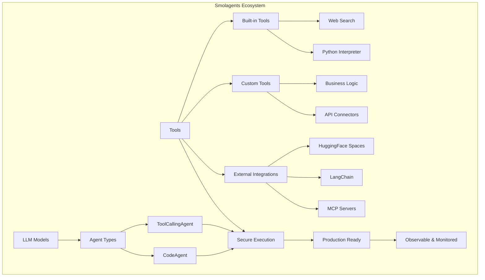

# Building Agentic Systems with Smolagents: A Comprehensive Tutorial

## Summary: Unlocking Agentic AI with Smolagents

[`smolagents`](https://github.com/huggingface/smolagents) is a powerful yet concise Python library designed to simplify the development and deployment of AI agents. It stands out by offering first-class support for "Code Agents," where Large Language Models (LLMs) write and execute Python code to perform tasks, enabling complex logic, dynamic tool composition, and emergent reasoning. Beyond this innovative approach, `smolagents` also supports traditional "Tool Calling Agents" that interact via structured JSON outputs.

The library boasts remarkable flexibility, being:
*   **Model-agnostic**: Connects to virtually any LLM, from local Transformers models and Ollama to cloud-based APIs like OpenAI, Anthropic, and Hugging Face Inference Providers (Cerebras, Cohere, Fal, Fireworks, Nebius, SambaNova, Together, etc.), including Azure OpenAI and Amazon Bedrock.
*   **Tool-agnostic**: Seamlessly integrates tools from various sources, including built-in functionalities (web search, Python interpreter), custom-defined Python functions, Hugging Face Spaces, LangChain, and Model Context Protocol (MCP) servers.
*   **Modality-agnostic**: Extends beyond text to handle vision, audio, and potentially other modalities as agent capabilities evolve.
*   **Secure**: Provides options for sandboxed code execution (E2B, Docker, WebAssembly) to mitigate risks associated with running LLM-generated code.
*   **Integrated**: Offers deep integration with the Hugging Face Hub for easy sharing and loading of agents and tools, and includes Gradio UI support for interactive debugging and demos.
*   **Observable**: Supports OpenTelemetry for detailed monitoring and inspection of agent runs, crucial for debugging and optimization in production.

This tutorial aims to guide you from foundational concepts to building sophisticated, production-ready agentic solutions using `smolagents`, connecting technical features to tangible business outcomes.

---

## Tutorial Sections

Each section will cover core concepts and demonstrate them through practical, real-world examples.

### 1. Getting Started with Smolagents

**[Read](./pages/01.md)**

**Concepts Covered:**
*   What is an AI Agent and why use one?
*   Overview of `smolagents` key features and philosophy.
*   Setting up your development environment.
*   Running your first basic agent.

**Outlines:**
*   Introduction to Agentic Systems: Why Agents?
*   The Smolagents Philosophy: Simplicity and Code-First Approach
*   Installation and Environment Setup
*   Your First Agent: A Quick Demo
*   Choosing Your LLM: A Guided Tour of Model Integrations

### 2. Understanding Agent Fundamentals: CodeAgent vs. ToolCallingAgent

**[Read](./pages/02.md)**

**Concepts Covered:**
*   The ReAct framework for multi-step reasoning.
*   Detailed mechanics of `CodeAgent` and `ToolCallingAgent`.
*   Strengths and limitations of each agent type.
*   Decision-making criteria for selecting the right agent paradigm.

**Outlines:**
*   The ReAct Framework: How Multi-step Agents Work
*   CodeAgent: Thinking and Acting in Python
*   ToolCallingAgent: Structured Interactions with JSON
*   When to Use Which: Choosing the Right Agent for Your Task
*   Under the Hood: Agent Memory and Execution Flow

### 3. Empowering Agents with Tools

**[Read](./pages/03.md)**

**Concepts Covered:**
*   Defining a tool's API and purpose.
*   Utilizing built-in tools for common tasks.
*   Creating custom tools tailored to specific business logic.
*   Leveraging external toolkits and platforms.

**Outlines:**
*   What is a Tool?: Anatomy and API Definition
*   Built-in Tools: Web Search, Python Interpreter, and More
*   Crafting Your Custom Tools: From Function to Business Logic
*   Sharing and Loading Tools: The Hugging Face Hub Integration
*   Integrating External Toolkits: LangChain and MCP Servers
*   Managing Your Agent's Toolbox: Adding and Removing Capabilities

### 4. Building Advanced Agent Architectures

**[Read](./pages/04.md)**

**Concepts Covered:**
*   Designing and implementing multi-agent collaboration.
*   Advanced memory management strategies.
*   Implementing human-in-the-loop workflows for oversight and refinement.
*   Developing asynchronous agent applications for scalability.

**Outlines:**
*   Orchestrating Multi-Agent Systems: Hierarchical and Collaborative Agents
*   Managing Agent Memory: Persistent State and Contextual Awareness
*   Human-in-the-Loop: Customizing Agent Plans Interactively
*   Asynchronous Agent Applications: Building Scalable Solutions

### 5. Ensuring Production Readiness: Security & Monitoring

**[Read](./pages/061.md)**

**Concepts Covered:**
*   Mitigating security risks with sandboxed code execution.
*   Implementing best practices for secure agent deployments.
*   Leveraging observability tools (OpenTelemetry) for debugging and performance.
*   Creating interactive user interfaces for agent interaction and demonstration.

**Outlines:**
*   Secure Code Execution: Local, Docker, E2B, and WebAssembly Sandboxes
*   Security Best Practices for Agent Deployments
*   Inspecting Agent Runs: Monitoring with OpenTelemetry and Specialized Platforms
*   Interactive Agent UIs: Building and Deploying with Gradio

### 6. Real-world Applications and Case Studies

**[Read](./pages/06.md)**

**Concepts Covered:**
*   Applying `smolagents` to solve complex business problems.
*   Optimizing agent performance for specific use cases.
*   Strategies for selecting and integrating different LLM models.

**Outlines:**
*   Self-Correcting Text-to-SQL Agents: Ensuring Data Accuracy
*   Building Agentic RAG Systems: Mastering Your Knowledge Base
*   Web Browser Automation with Vision Agents: Navigating Complex UIs
*   Using Different LLMs: Optimizing Performance and Cost
*   Case Study: Advanced Research with Multi-Agent Web Browsers (Open Deep Research)