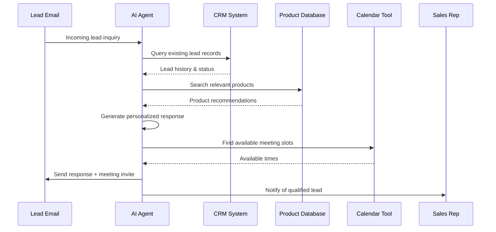

#  Getting Started with Smolagents: Build Your First AI Agent

Welcome to the ultimate guide to `smolagents`, a powerful yet minimalistic Python library for building intelligent AI agents. This tutorial is designed to quickly get you up and running, transforming theoretical AI concepts into practical, business-ready solutions.

Whether you're a developer looking to integrate cutting-edge AI into your applications, or a business professional eager to understand the tangible benefits of agentic systems, you're in the right place.

##  Introduction to Agentic Systems: Why Agents?

Imagine an employee who can not only understand your instructions but also actively *execute* tasks, use tools, and adapt their approach based on real-time feedback. That's the power of an AI agent.

At its core, an **AI Agent** is a program where the output of a Large Language Model (LLM) doesn't just generate text, but actively controls the workflow and interacts with external tools.

### Why do we need AI Agents in business?

Traditional LLMs are brilliant at generating human-like text, but they lack the ability to *act*. They can tell you *what* to do, but they can't *do* it themselves. This gap between "knowing" and "doing" is where AI agents shine, transforming LLMs from mere content generators into powerful problem-solvers.

Let's look at how agents can revolutionize daily enterprise routines:

**Scenario 1: Sales Lead Qualification**

*   **Without Agents:** A sales representative receives an email from a potential lead. They then manually:
    1.  Read the email to understand the inquiry.
    2.  Open the CRM system to check if the lead already exists.
    3.  Search the company's product database for relevant solutions.
    4.  Draft a personalized email response.
    5.  Schedule a follow-up call.
    This process is repetitive, time-consuming, and prone to human error.

*   **With Agents:** An AI agent is deployed to assist the sales team.
    1.  The agent receives the incoming lead email.
    2.  It automatically queries the CRM to identify existing records and gather lead history.
    3.  It analyzes the inquiry and identifies the most suitable product or service from the product catalog (using a `ProductDatabaseTool`).
    4.  It drafts a personalized email, incorporating lead data and product information.
    5.  It uses a `CalendarTool` to find an available slot in the sales rep's calendar and sends a meeting invitation to the lead.
    **Business Outcome:** Faster lead response times, increased sales team efficiency, improved lead qualification, and higher conversion rates.



**Scenario 2: HR Policy Look-up**

*   **Without Agents:** An employee has a question about the company's leave policy (e.g., "How many days off am I eligible for after 3 years?"). They typically:
    1.  Search the internal HR portal or company wiki.
    2.  Read through lengthy policy documents.
    3.  Manually calculate eligibility based on service years.
    This can be frustrating for employees and a drain on HR resources.

*   **With Agents:** An HR policy agent is implemented.
    1.  The employee types their question into a chat interface.
    2.  The agent uses a `KnowledgeBaseRetrievalTool` to instantly search and extract relevant information from HR policy documents.
    3.  It performs the necessary calculations (e.g., `PythonInterpreterTool` for logic) based on the employee's tenure (fetched from an `EmployeeDataTool`).
    4.  It provides a concise, accurate answer directly to the employee.
    **Business Outcome:** Reduced HR workload, faster employee query resolution, improved employee satisfaction, and consistent policy enforcement.

These examples illustrate how AI agents bridge the gap between information and action, enabling unprecedented levels of automation and efficiency across various business functions.

##  The Smolagents Philosophy: Simplicity and Code-First Approach

The `smolagents` library stands out with its core philosophy:
*   **Simplicity:** The library is designed to be "small" (hence "smol"). Its core logic is contained in approximately 1,000 lines of code, minimizing abstraction layers. This makes `smolagents` easy to understand, customize, and debug, giving you full control over your agent's behavior.
*   **Code-First Approach:** Unlike many frameworks that rely on JSON blobs or complex declarative formats for tool calls, `smolagents` champions the idea of agents writing their actions as **Python code snippets**.
    *   **Why Code?** Python, as a programming language, is inherently designed to express complex logic, control flow (loops, conditionals), and function composition. When an agent writes code, it naturally gains capabilities like chaining multiple tool calls, performing intermediate computations, and dynamic problem-solving. This approach has been shown in research to lead to more robust and efficient agents.
    *   **Flexibility:** While `smolagents` prioritizes code-based agents (`CodeAgent`), it also provides a `ToolCallingAgent` for scenarios where structured JSON tool calls are preferred (e.g., for simpler, atomic tool interactions).

Beyond its core philosophy, `smolagents` offers a rich set of features designed for enterprise-grade solutions:
*   **Hub Integrations:** Seamlessly share your custom agents and tools to the Hugging Face Hub, or pull pre-built ones from the community. This fosters collaboration and accelerates development.
*   **Model-Agnostic:** Connect your agents to any LLM! Whether it's a model hosted on the Hugging Face Hub (via Inference Providers), a proprietary API like OpenAI or Anthropic (via LiteLLM integration), or even a model running locally (using Transformers or Ollama).
*   **Modality-Agnostic:** Agents can process and generate beyond just text; they can handle vision, video, and audio inputs, opening doors for a wide array of multimodal applications.
*   **Tool-Agnostic:** Integrate tools from diverse sources, including LangChain, MCP (Model Context Protocol) servers, or even turn a Hugging Face Space into a callable tool.
*   **Security:** For code-executing agents, security is paramount. `smolagents` provides built-in options for sandboxed execution using E2B, Docker, or WebAssembly, mitigating the risks of arbitrary code execution.

## 🏃 Your First Agent: A Quick Demo

Let's dive into a practical example. Imagine you're a marketing analyst, and your task is to quickly gather competitive pricing data for a new product launch.

**The Problem (Without Agents):** This would typically involve manually searching various competitor websites, navigating through product pages, and extracting pricing information. It's tedious and time-consuming.

**The Agent Solution:** We'll build a `smolagents` agent that can use a web search tool to find this information automatically.

```python
# 1. Install necessary packages (if not already installed)
#    pip install "smolagents[toolkit]" python-dotenv

# 2. Load environment variables (e.g., HF_TOKEN for InferenceClientModel)
from dotenv import load_dotenv
load_dotenv()

# 3. Import the core components
from smolagents import CodeAgent, InferenceClientModel, LiteLLMModel
from smolagents.default_tools import DuckDuckGoSearchTool # For web search

# 4. Initialize the LLM model to power your agent
#    We'll use Hugging Face's InferenceClientModel, which connects to hosted models.
#    It uses a default model if model_id is not specified, or you can pick one.
#    Ensure your HF_TOKEN is set as an environment variable for best results.
print("Initializing LLM model...")

# using a specific model from Hugging Face Inference API
llm_model = InferenceClientModel(model_id="Qwen/Qwen2.5-Coder-32B-Instruct") 

# -- OR -- 
# using LiteLLM for more flexibility with different providers
llm_model = LiteLLMModel(model_id="gpt-4.1-mini")
```

Lets check our first tool-supported agent:

```python

from smolagents.default_tools import WikipediaSearchTool

wiki_agent = CodeAgent(
    tools=[WikipediaSearchTool()],  # Provide the list of tools the agent has access to
    model=llm_model,          # Link the agent to its LLM brain
    stream_outputs=True,      # See the agent's thoughts and actions in real-time
    verbosity_level=1         # Adjust verbosity (0: silent, 1: info, 2: debug)
)

wiki_agent.run('Who is the current President of Moroco and how old is he?')
print("\n--- Running the Agent ---")

```

You will deserve how the agent will depend on the LLM to generate the code to use the Wikipedia search tool, and then it will execute that code to fetch the answer.

Now, let's build our marketing research agent:

```python

# 5. Define the tools your agent can use
#    We'll give it a web search tool to find information online.
web_search_tool = DuckDuckGoSearchTool()
print(f"Agent will use the tool: {web_search_tool.name}")

# 6. Create your CodeAgent
#    The CodeAgent thinks in Python code and uses the provided tools.
print("Creating the CodeAgent...")
marketing_research_agent = CodeAgent(
    tools=[web_search_tool],  # Provide the list of tools the agent has access to
    model=llm_model,          # Link the agent to its LLM brain
    stream_outputs=True,      # See the agent's thoughts and actions in real-time
    verbosity_level=1         # Adjust verbosity (0: silent, 1: info, 2: debug)
)
print("CodeAgent created. Ready to assist!")

# 7. Run the agent with a specific task
print("\n--- Running the Agent ---")
task_description = (
    "Find the current market price for our competitor 'Samsung's' new 'Tablets' "
    "products in Egypt which have 10 or more inch screens."
    "List the top 5 results with their prices and links."
)
print(f"Agent's Task: {task_description}")

# The agent will now use its LLM brain and tools to solve the task.
# Watch its "thoughts" and "actions" in your console!
final_result = marketing_research_agent.run(task_description)

# 8. Display the final result
print("\n--- Agent Task Completed ---")
print(f"Final Answer from Agent: {final_result}")

```

**Explanation of the Demo:**
*   **`InferenceClientModel`**: This connects your agent to a powerful LLM hosted on the Hugging Face Hub. It handles sending messages to the model and receiving its responses.
*   **`DuckDuckGoSearchTool()`**: This is a pre-built tool that allows your agent to perform web searches. The agent learns how to use this tool through its `description` and `inputs` metadata, which are injected into the LLM's prompt.
*   **`CodeAgent`**: This is where the magic happens! The `CodeAgent` processes your request, decides which tool to use (if any), and writes the Python code to execute that tool. It then observes the tool's output and continues its reasoning loop until it reaches a `final_answer`.
*   **`stream_outputs=True`**: This flag lets you see the agent's internal monologue – its "thoughts" and the "code" it generates – directly in your console, providing transparency into its problem-solving process.

This simple example demonstrates how a `smolagents` agent can automate a common business task by intelligently using external tools, saving valuable time and resources.

##  Choosing Your LLM: A Guided Tour of Model Integrations

`smolagents` is designed to be highly flexible when it comes to the underlying Large Language Model (LLM) that powers your agents. You can plug in various models from different providers, ensuring you use the best tool for your specific task and budget.

Below, we explore common LLM integrations with `smolagents`, each with a business-relevant example.

```python
# Ensure all necessary extras are installed based on your choices:
# pip install "smolagents[toolkit,transformers,litellm,openai,bedrock,mlx-lm]" python-dotenv

from dotenv import load_dotenv
import os
# Load environment variables for API keys
load_dotenv()

# Common imports for all examples
from smolagents import CodeAgent, InferenceClientModel
from smolagents.default_tools import DuckDuckGoSearchTool, WikipediaSearchTool

# A simple task for demonstration across different models
common_task = "What is the capital of France?"
common_tools = [DuckDuckGoSearchTool()] # Using a simple tool for consistency

print("--- Starting LLM Integration Tour ---")

# --- 1. Hugging Face Inference API (InferenceClientModel) ---
# Best for: Accessing a wide range of open-source models hosted on Hugging Face.
# Business Use Case: Rapid prototyping, cost-effective deployments, leveraging specialized models.
# Example: Summarizing competitor analysis reports.
print("\n--- 1. Using Hugging Face Inference API (InferenceClientModel) ---")
try:
    # Requires HF_TOKEN environment variable
    hf_model = InferenceClientModel(model_id="Qwen/Qwen2.5-Coder-32B-Instruct", token=os.getenv("HF_TOKEN"))
    hf_agent = CodeAgent(tools=common_tools, model=hf_model, verbosity_level=1)
    print(f"Agent (InferenceClientModel) Answer: {hf_agent.run(common_task)}")

    # Business Example: Summarize key takeaways from a long analysis document
    # For a real scenario, this would involve a tool to read the document.
    # For this demo, we'll simplify.
    hf_agent.tools['wikipedia_search'] = WikipediaSearchTool() # Add a wikipedia tool to simulate knowledge access
    print(f"Agent (InferenceClientModel) Business Answer: {hf_agent.run('Who is the current CEO of Microsoft and what are their recent initiatives in AI?')}")

except Exception as e:
    print(f"Could not run InferenceClientModel example. Ensure HF_TOKEN is set and model is accessible: {e}")

# --- 2. Local Transformers Model ---
# Best for: Running models entirely on your own infrastructure for privacy, low latency, or specific hardware.
# Business Use Case: On-premise data processing, highly sensitive information handling, edge AI.
# Example: Drafting internal HR communications without external API calls.
print("\n--- 2. Using Local Transformers Model ---")
try:
    from smolagents import TransformersModel
    # device_map="auto" intelligently distributes the model across available devices (CPU, GPU).
    # This example uses a smaller model to run well on CPU if no GPU is available.
    local_model = TransformersModel(model_id="HuggingFaceTB/SmolLM2-135M-Instruct", device_map="cpu", max_new_tokens=200)
    local_agent = CodeAgent(tools=common_tools, model=local_model, verbosity_level=1)
    print(f"Agent (TransformersModel) Answer: {local_agent.run(common_task)}")

    # Business Example: Draft a concise internal announcement for a new IT policy
    business_task_local = "Draft a short, formal announcement for employees about mandatory password resets next Monday, emphasizing security."
    print(f"\nBusiness Example Task: {business_task_local}")
    print(f"Agent (TransformersModel) Business Answer: {local_agent.run(business_task_local)}")

except Exception as e:
    print(f"Could not run TransformersModel example. Ensure 'smolagents[transformers]' is installed and sufficient resources: {e}")

# --- 3. LiteLLM (OpenAI, Anthropic, Ollama, and 100+ others) ---
# Best for: Unified access to a vast array of commercial and open-source APIs.
# Business Use Case: Flexible integration with multiple vendors, A/B testing different LLMs, quick switching between providers.
# Example: Generating dynamic marketing copy based on customer segments via different LLMs.
print("\n--- 3. Using LiteLLMModel ---")
try:
    from smolagents import LiteLLMModel
    # Using GPT-4o via LiteLLM (requires OPENAI_API_KEY)
    # Alternatively, for Anthropic: model_id="anthropic/claude-3-5-sonnet-latest" (requires ANTHROPIC_API_KEY)
    # Or for Ollama: model_id="ollama/llama3", api_base="http://localhost:11434" (requires local Ollama server)
    litellm_model = LiteLLMModel(model_id="gpt-4o-mini", api_key=os.getenv("OPENAI_API_KEY"))
    litellm_agent = CodeAgent(tools=common_tools, model=litellm_model, verbosity_level=1)
    print(f"Agent (LiteLLMModel) Answer: {litellm_agent.run(common_task)}")

    # Business Example: Generate a persuasive ad headline for a new product, appealing to different segments
    business_task_litellm = "Generate 3 compelling, short ad headlines for a 'Sustainable Home Cleaning Kit'. Focus on eco-friendliness, effectiveness, and convenience."
    print(f"\nBusiness Example Task: {business_task_litellm}")
    print(f"Agent (LiteLLMModel) Business Answer: {litellm_agent.run(business_task_litellm)}")

except Exception as e:
    print(f"Could not run LiteLLMModel example. Ensure 'smolagents[litellm]' is installed and API keys are set: {e}")

# --- 4. Azure OpenAI Server Model ---
# Best for: Enterprises using Microsoft Azure ecosystem, leveraging existing Azure credits and compliance.
# Business Use Case: Secure, enterprise-grade AI applications within Azure, integration with Azure services.
# Example: Automating customer support responses with Azure-hosted LLMs.
print("\n--- 4. Using AzureOpenAIServerModel ---")
try:
    from smolagents import AzureOpenAIServerModel
    # Requires AZURE_OPENAI_ENDPOINT, AZURE_OPENAI_API_KEY, OPENAI_API_VERSION environment variables
    azure_model = AzureOpenAIServerModel(
        model_id=os.getenv("AZURE_OPENAI_MODEL"), # e.g., "gpt-4o-mini-deployment"
        azure_endpoint=os.getenv("AZURE_OPENAI_ENDPOINT"),
        api_key=os.getenv("AZURE_OPENAI_API_KEY"),
        api_version=os.getenv("OPENAI_API_VERSION")
    )
    azure_agent = CodeAgent(tools=common_tools, model=azure_model, verbosity_level=1)
    print(f"Agent (AzureOpenAIServerModel) Answer: {azure_agent.run(common_task)}")

    # Business Example: Summarize customer service chat transcripts for sentiment analysis
    business_task_azure = "Analyze the following customer service transcript for sentiment (positive, negative, neutral) and identify the main issue discussed: 'Customer: My internet is constantly dropping. Agent: I understand your frustration. Let me check your connection. Customer: This is unacceptable!' "
    print(f"\nBusiness Example Task: {business_task_azure}")
    print(f"Agent (AzureOpenAIServerModel) Business Answer: {azure_agent.run(business_task_azure)}")

except Exception as e:
    print(f"Could not run AzureOpenAIServerModel example. Ensure 'smolagents[openai]' is installed and Azure credentials are set: {e}")

# --- 5. Amazon Bedrock Server Model ---
# Best for: AWS-centric enterprises, integrating with other AWS services like S3, Lambda.
# Business Use Case: Data-intensive workloads on AWS, building AI features directly within AWS infrastructure.
# Example: Analyzing large datasets of product reviews stored in S3.
print("\n--- 5. Using AmazonBedrockServerModel ---")
try:
    from smolagents import AmazonBedrockServerModel
    # Requires AWS credentials configured (e.g., AWS_ACCESS_KEY_ID, AWS_SECRET_ACCESS_KEY, AWS_REGION)
    bedrock_model = AmazonBedrockServerModel(model_id="anthropic.claude-3-sonnet-20240229-v1:0")
    bedrock_agent = CodeAgent(tools=common_tools, model=bedrock_model, verbosity_level=1)
    print(f"Agent (AmazonBedrockServerModel) Answer: {bedrock_agent.run(common_task)}")

    # Business Example: Classify incoming support tickets based on their content (e.g., 'technical', 'billing', 'feature_request')
    business_task_bedrock = "Classify the following support ticket text: 'My account was charged twice for the last subscription period, and I cannot access my premium features.' "
    print(f"\nBusiness Example Task: {business_task_bedrock}")
    print(f"Agent (AmazonBedrockServerModel) Business Answer: {bedrock_agent.run(business_task_bedrock)}")

except Exception as e:
    print(f"Could not run AmazonBedrockServerModel example. Ensure 'smolagents[bedrock]' is installed and AWS credentials are set: {e}")

# --- 6. MLX Model ---
# Best for: Apple Silicon (M1/M2/M3 chips) users for local, efficient inference.
# Business Use Case: Local development on Mac, offline AI applications, private data analysis on personal devices.
# Example: Generating meeting summaries directly on a MacBook without cloud access.
print("\n--- 6. Using MLXModel ---")
try:
    from smolagents import MLXModel
    # MLX models are optimized for Apple Silicon. May require specific MLX model IDs.
    mlx_model = MLXModel(model_id="mlx-community/Qwen2.5-Coder-32B-Instruct-4bit")
    mlx_agent = CodeAgent(tools=common_tools, model=mlx_model, verbosity_level=1)
    print(f"Agent (MLXModel) Answer: {mlx_agent.run(common_task)}")

    # Business Example: Auto-generate code snippets for data analysis tasks directly on a developer's Mac.
    business_task_mlx = "Write a Python function using pandas to calculate the moving average of a 'sales' column in a DataFrame, given a window size."
    print(f"\nBusiness Example Task: {business_task_mlx}")
    print(f"Agent (MLXModel) Business Answer: {mlx_agent.run(business_task_mlx)}")

except Exception as e:
    print(f"Could not run MLXModel example. Ensure 'smolagents[mlx-lm]' is installed and you are on Apple Silicon: {e}")

print("\n--- LLM Integration Tour Completed ---")
```

This comprehensive tour demonstrates `smolagents`' versatility, allowing you to select the LLM that best fits your specific business needs, infrastructure, and privacy requirements. As you continue your journey with `smolagents`, you'll find this flexibility invaluable for building robust and scalable AI solutions.