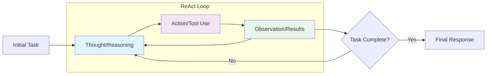
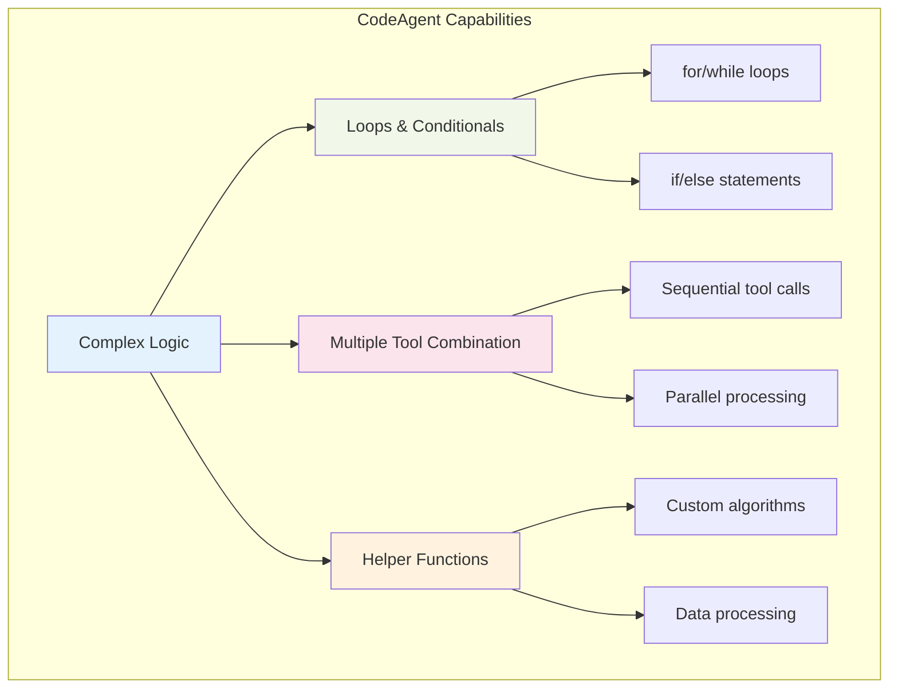
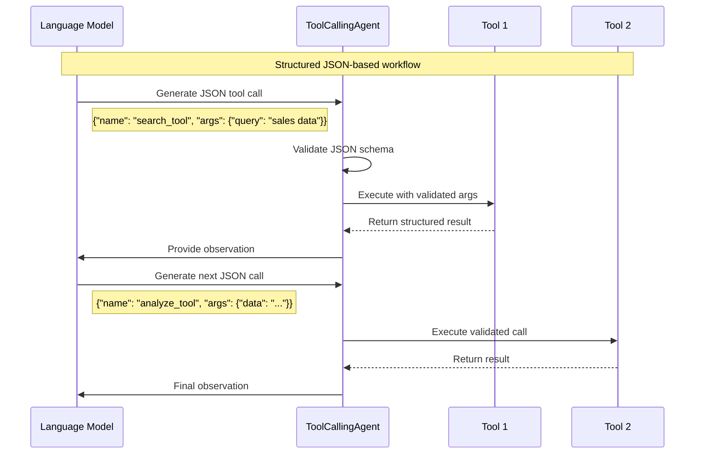
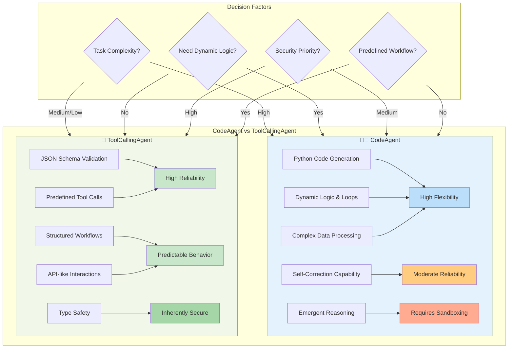

# Understanding Agent Fundamentals: CodeAgent vs. ToolCallingAgent

Welcome to this comprehensive tutorial on agent fundamentals within the Smolagent library! In the world of AI, agents are powerful tools that enable Large Language Models (LLMs) to perform complex, multi-step tasks by interacting with external environments, just like a human would.

By the end of this tutorial, you'll understand the core concepts behind Smolagent's two primary agent types – `CodeAgent` and `ToolCallingAgent` – and gain practical insights into choosing the right one for your real-world business challenges.

## 🤖 The ReAct Framework: How Multi-step Agents Work

At the heart of Smolagent's multi-step agents lies the **ReAct (Reasoning and Acting) framework**. This framework empowers agents to tackle problems that require more than a single LLM query. Instead, an agent operates in a continuous loop of:

1.  **Thought (Reasoning):** The LLM analyzes the current situation, assesses its progress towards the task, and decides on the next logical step.
2.  **Action (Acting):** Based on its reasoning, the LLM determines which tool(s) to use and with what arguments. This action is then executed.
3.  **Observation:** The agent receives the outcome of the executed action (e.g., search results, API response, code output). This observation feeds back into the agent's memory, informing its next reasoning step.

This loop continues until the agent determines it has successfully completed the task or reaches a predefined limit.



Let's consider a common business scenario: **Qualifying a Sales Lead**.

A single LLM might summarize a lead's profile. But a multi-step agent could:

*   **Thought:** "I need to check the company's recent news to assess market fit."
*   **Action:** Use a "web search" tool for "XYZ Corp latest news."
*   **Observation:** Receives search results.
*   **Thought:** "The news mentions a recent acquisition, which is a good sign. Now I need to check if their industry matches our target sectors."
*   **Action:** Use a "CRM lookup" tool for "XYZ Corp industry."
*   **Observation:** Receives "Software Development."
*   **Thought:** "This lead looks promising. I should add them to the 'High-Potential Leads' list in the CRM."
*   **Action:** Use a "CRM update" tool to change lead status.
*   **Observation:** Confirmation of CRM update.
*   **Thought:** "Task complete. This lead is qualified."

This iterative process of thinking, acting, and observing allows agents to navigate complex, dynamic tasks.

## 🧑‍💻 CodeAgent: Thinking and Acting in Python

The `CodeAgent` is Smolagent's flagship agent type, designed for scenarios where the agent needs maximum flexibility and emergent reasoning capabilities. Unlike agents that generate structured JSON calls, `CodeAgent` empowers the LLM to **write actual Python code snippets** to perform its actions.

### How it Works

When you interact with a `CodeAgent`:

1.  The LLM generates Python code (e.g., importing libraries, calling functions, implementing loops or conditionals).
2.  This code is then executed by a secure Python interpreter.
3.  The output of the code execution (e.g., print statements, function return values, errors) becomes the "observation" for the next step.

Tools are exposed as callable Python functions directly within the agent's execution environment.

### Strengths

*   **Highly Expressive:** The agent can write complex logic, combine multiple tools in a single step, implement loops (`for`, `while`), conditionals (`if/else`), and define helper functions. This mimics a human programmer's workflow.



*   **Flexible:** No need to predefine every possible action. The agent can dynamically generate new actions and adapt its approach based on observations.
*   **Emergent Reasoning:** Ideal for open-ended, multi-step problems where the exact solution path is unknown beforehand. It can explore, debug its own code, and self-correct.

### Limitations

*   **Risk of Errors:** The LLM might generate syntactically incorrect code or code that leads to runtime errors, requiring robust error handling and retry mechanisms.
*   **Less Predictable:** Due to its flexibility, the `CodeAgent`'s behavior can be less predictable than a `ToolCallingAgent`, which can be a concern for strict compliance or sensitive operations.
*   **Requires Secure Execution Environment:** Since arbitrary code is generated and executed, a secure sandbox (like E2B or Docker, discussed in the [secure code execution tutorial](/docs/smolagents/tutorials/secure_code_execution)) is crucial to prevent malicious or accidental system damage.

### Business Example: Dynamic Market Research & Analysis

Imagine a **Marketing Team** needing to understand competitor strategies:

**Task:** "Analyze recent trends in AI startups for Q3 2024, identify the top 3 with the highest funding growth, and summarize their key innovations based on publicly available data."

A `CodeAgent` is perfect here because the exact steps for data extraction, cleaning, and analysis are not fixed. It might need to:

1.  **Search:** Find recent tech news and funding rounds.
2.  **Parse:** Extract company names, funding amounts, and dates from various web pages.
3.  **Analyze (in Python):** Use `pandas` for data structuring, calculate growth rates, sort, and filter.
4.  **Summarize:** Synthesize findings.

Here's how a `CodeAgent` might start its work:

```python
from smolagents import CodeAgent, WebSearchTool, InferenceClientModel

# Initialize an LLM model. For real-world use, consider a powerful model like Llama-3.1-405B or GPT-4o.
# You might need to set your HF_TOKEN or respective API keys in your environment variables.
# For this example, we use a placeholder model ID.
model = InferenceClientModel(model_id="meta-llama/Llama-3.1-8B-Instruct")

# Define the agent with necessary tools and allow 'pandas' for data manipulation
# 'add_base_tools=True' includes essential tools like web_search
agent = CodeAgent(
    tools=[WebSearchTool()],
    model=model,
    add_base_tools=True,
    additional_authorized_imports=['pandas', 're'], # Authorize imports for data processing and regex
    max_steps=10, # Allow enough steps for complex tasks
    verbosity_level=1 # Show agent's thought process
)

# Run the market research task
print("Starting Market Research Agent...")
market_research_report = agent.run(
    "Analyze recent trends in AI startups for Q3 2024 and identify the top 3 with the highest funding growth. Summarize their key innovations based on publicly available data."
)

print("\n--- Market Research Report ---")
print(market_research_report)
```

In this example, the `CodeAgent` would iteratively search for information, process it using dynamically generated Python code (e.g., using `pandas` to structure and analyze data from search results), and refine its approach until it can produce the final report.

## 📑 ToolCallingAgent: Structured Interactions with JSON

The `ToolCallingAgent` represents a more traditional approach to agentic systems, where the LLM's actions are strictly defined as **structured JSON objects**. This aligns with common API patterns used by many LLM providers (like OpenAI's function calling).



### How it Works

With a `ToolCallingAgent`:

1.  Tools are defined with a clear JSON schema (name, description, parameter types).
2.  The LLM generates a JSON object specifying the tool's name and its arguments.
3.  The framework parses this JSON, validates the arguments against the schema, and then executes the corresponding tool function.
4.  The tool's output becomes the "observation."

### Strengths

*   **Reliable:** Outputs are highly structured and validated against predefined schemas, significantly reducing hallucination and malformed responses.
*   **Safe:** Arguments are strictly validated, and there's no risk of arbitrary code execution, making it safer for sensitive operations or when using less trusted models.
*   **Interoperable:** Easy to integrate with existing external APIs or services that expect structured calls.
*   **Predictable:** The agent's actions are constrained by the defined tool schemas, leading to more predictable behavior.

### Limitations

*   **Lower Expressivity:** Cannot easily combine or transform results dynamically within a single action step. Complex logic often requires multiple sequential tool calls.
*   **Inflexible:** All possible actions must be predefined in advance within the tool schemas. It's limited to the capabilities of its pre-built tools.
*   **No Code Synthesis:** The agent cannot write new code or adapt to completely novel situations that aren't covered by its tools.

### Business Example: Standardized HR Onboarding Workflows

Consider a **Human Resources (HR) Department** that needs to automate onboarding for new hires:

**Task:** "Onboard new employee Jane Doe (ID: JD123), starting salary $60,000, department 'Marketing'. Send welcome email and assign mandatory compliance training."

A `ToolCallingAgent` is ideal here because the onboarding steps are sequential, well-defined, and map directly to specific HR system APIs.

Let's define a couple of hypothetical HR tools:

```python
from smolagents import ToolCallingAgent, InferenceClientModel, tool

# --- Define custom HR Tools ---

@tool
def add_employee_to_payroll(employee_id: str, full_name: str, salary: float, department: str) -> str:
    """
    Adds a new employee record to the payroll system.
    Args:
        employee_id: Unique identifier for the employee (e.g., JD123).
        full_name: Full name of the new employee (e.g., Jane Doe).
        salary: Annual salary of the employee (e.g., 60000.0).
        department: Department the employee belongs to (e.g., Marketing).
    Returns:
        A confirmation message indicating success or failure.
    """
    print(f"Simulating: Adding {full_name} ({employee_id}) to payroll with salary ${salary} in {department} department.")
    # In a real system, this would call an external HRIS API
    return f"Employee {full_name} (ID: {employee_id}) successfully added to payroll."

@tool
def send_welcome_email(employee_id: str, recipient_email: str) -> str:
    """
    Sends a standardized welcome email to a new employee.
    Args:
        employee_id: Unique identifier for the employee.
        recipient_email: Email address of the employee.
    Returns:
        A confirmation message if the email was sent.
    """
    print(f"Simulating: Sending welcome email to {recipient_email} for employee {employee_id}.")
    # In a real system, this would integrate with an email service
    return f"Welcome email sent to {recipient_email}."

@tool
def assign_mandatory_training(employee_id: str, training_plan_id: str) -> str:
    """
    Assigns a mandatory training plan to a new employee in the LMS (Learning Management System).
    Args:
        employee_id: Unique identifier for the employee.
        training_plan_id: Identifier for the compliance training plan (e.g., COMPLY2024).
    Returns:
        A confirmation message if training was assigned.
    """
    print(f"Simulating: Assigning training '{training_plan_id}' to employee {employee_id}.")
    # In a real system, this would call an LMS API
    return f"Mandatory training '{training_plan_id}' assigned to {employee_id}."

# --- Initialize Agent ---

# Using a model that supports tool-calling
model = InferenceClientModel(model_id="meta-llama/Llama-3.1-8B-Instruct")

# Create the ToolCallingAgent with our HR tools
hr_onboarding_agent = ToolCallingAgent(
    tools=[add_employee_to_payroll, send_welcome_email, assign_mandatory_training],
    model=model,
    max_steps=5, # Limited steps as the workflow is predictable
    verbosity_level=1 # See the tool calls and observations
)

# Run the onboarding task
print("Starting HR Onboarding Agent...")
onboarding_result = hr_onboarding_agent.run(
    "Onboard new employee Jane Doe (ID: JD123), starting salary $60,000, department 'Marketing'. Her email is jane.doe@example.com. Assign mandatory compliance training 'COMPLY2024'."
)

print("\n--- Onboarding Summary ---")
print(onboarding_result)
```

The `ToolCallingAgent` will generate a sequence of JSON tool calls, ensuring each step of the onboarding process is executed reliably and with validated inputs.

## ⚖️ When to Use Which: Choosing the Right Agent for Your Task

The choice between `CodeAgent` and `ToolCallingAgent` depends heavily on the nature of your business task:



| Feature/Criteria          | `CodeAgent`                                       | `ToolCallingAgent`                                |
| :------------------------ | :------------------------------------------------ | :------------------------------------------------ |
| **Task Complexity**       | High (dynamic, multi-faceted, unknown path)       | Medium (sequential, well-defined, known path)     |
| **Need for Dynamic Logic**| High (loops, conditionals, custom algorithms)     | Low (predefined API calls)                        |
| **Data Transformation**   | High (manipulate data, merge, pivot)              | Low (pass data as is to tools)                    |
| **Reliability/Predictability**| Moderate (more prone to errors, but self-corrects)| High (structured, validated outputs)              |
| **Security Considerations**| Requires strong sandboxing (E2B, Docker)          | Inherently safer (no arbitrary code execution)    |
| **Use Case Examples**     | Market research, data analysis, complex troubleshooting, software development assistance, financial modeling, content generation with complex constraints. | HR onboarding, customer support ticketing, sales automation (CRM updates), inventory management, standard reporting. |

**Decision Tree:**

1.  **Is the task highly analytical or does it require dynamic data manipulation (e.g., parsing, calculation, filtering across varied sources)?**
    *   **Yes:** Consider `CodeAgent`. Its ability to write and execute Python code makes it highly flexible for these tasks.
    *   **No:** Proceed to step 2.
2.  **Are the steps to achieve the task clearly defined, sequential, and do they map directly to existing APIs or discrete functions?**
    *   **Yes:** `ToolCallingAgent` is likely a better fit due to its reliability and structured approach.
    *   **No:** If the steps are ambiguous or require creative problem-solving, `CodeAgent` might be necessary, even with its higher complexity.
3.  **What are your security requirements? Is executing potentially arbitrary code acceptable within a sandbox?**
    *   **High Security / No Code Execution:** Prioritize `ToolCallingAgent`.
    *   **Can Use Sandboxes:** `CodeAgent` is viable with proper isolation.

### Workflow Comparison: Same Task, Different Approaches

Let's see how both agents would handle the same business task: "Analyze customer purchase patterns and identify top 3 products by revenue."

```mermaid
flowchart TD
    subgraph "Task: Analyze Customer Purchase Patterns"
        T[Identify top 3 products by revenue]
    end
    
    subgraph CA["🧑‍💻 CodeAgent Approach"]
        CA1[Generate Python Code]
        CA2["```python
        import pandas as pd
        data = fetch_sales_data()
        df = pd.DataFrame(data)
        revenue_by_product = df.groupby('product')['revenue'].sum()
        top_3 = revenue_by_product.nlargest(3)
        print(top_3)
        ```"]
        CA3[Execute Code Dynamically]
        CA4[Handle Errors & Self-Correct]
        CA5[Generate Insights & Visualizations]
        
        CA1 --> CA2
        CA2 --> CA3
        CA3 --> CA4
        CA4 --> CA5
    end
    
    subgraph TA["📑 ToolCallingAgent Approach"]
        TA1[Call: fetch_sales_data]
        TA2[Call: group_by_product]
        TA3[Call: calculate_revenue_sum]
        TA4[Call: sort_descending]
        TA5[Call: get_top_n]
        TA6[Call: format_results]
        
        TA1 --> TA2
        TA2 --> TA3
        TA3 --> TA4
        TA4 --> TA5
        TA5 --> TA6
    end
    
    T --> CA1
    T --> TA1
    
    subgraph "Key Differences"
        D1["CodeAgent: Single flexible code block
        - Can adapt logic on the fly
        - Handles complex transformations
        - May need error handling"]
        
        D2["ToolCallingAgent: Multiple structured calls
        - Each step predefined & validated
        - Clear audit trail
        - Limited to existing tools"]
    end
    
    CA5 --> D1
    TA6 --> D2
    
    style CA fill:#e3f2fd
    style TA fill:#f1f8e9
    style CA2 fill:#fff3e0
    style D1 fill:#e8eaf6
    style D2 fill:#e0f2f1
```

## 💡 Under the Hood: Agent Memory and Execution Flow

Regardless of whether you choose `CodeAgent` or `ToolCallingAgent`, a crucial component enabling their multi-step reasoning is **Agent Memory**. Smolagent provides a robust memory system that keeps track of the entire interaction history.

```mermaid
graph TB
    subgraph "Internal Architecture Comparison"
        subgraph CA["CodeAgent Architecture"]
            CA1[LLM Input] --> CA2[Python Code Generation]
            CA2 --> CA3[Code Execution Engine]
            CA3 --> CA4[Python Interpreter]
            CA4 --> CA5[Tool Functions Available]
            CA5 --> CA6[Execution Results]
            CA6 --> CA7[Error Handling & Retry]
            CA7 --> CA8[Memory Update]
            
            CA3 -.->|"import pandas
            for item in data:
                process(item)"| CA4
        end
        
        subgraph TA["ToolCallingAgent Architecture"]
            TA1[LLM Input] --> TA2[JSON Schema Generation]
            TA2 --> TA3[Schema Validation]
            TA3 --> TA4[Tool Registry Lookup]
            TA4 --> TA5[Function Execution]
            TA5 --> TA6[Structured Results]
            TA6 --> TA7[Memory Update]
            
            TA2 -.->|'{"name": "analyze_tool",
            "args": {"data": [...]}}'| TA3
        end
        
        subgraph "Shared Components"
            M[Agent Memory System]
            R[ReAct Loop Controller]
            T[Tool Registry]
        end
    end
    
    CA8 --> M
    TA7 --> M
    M --> R
    R --> CA1
    R --> TA1
    T --> CA5
    T --> TA4
    
    style CA fill:#e3f2fd
    style TA fill:#f1f8e9
    style M fill:#fff3e0
    style R fill:#f3e5f5
    style T fill:#e8f5e8
```

The `agent.memory` object stores every significant event during a run:

*   **`SystemPromptStep`**: The initial instructions given to the agent.
*   **`TaskStep`**: The user's original request.
*   **`PlanningStep` (Optional):** If enabled, the agent's high-level strategic plan and facts.
*   **`ActionStep`**: Represents each turn of the ReAct loop, including:
    *   The LLM's **thought/reasoning**.
    *   The **tool call(s)** generated by the LLM (either Python code or JSON).
    *   The **observation(s)** received from the tool execution.
    *   Any **errors** encountered during execution.
    *   **Token usage** and **timing** for that step.
*   **`FinalAnswerStep`**: The ultimate conclusion provided by the agent.

This memory acts as the agent's "scratchpad" and "history book." At each new step, the agent's LLM engine receives a distilled version of this memory as its input messages, allowing it to learn from past actions, debug errors, and progressively work towards the solution.

You can inspect the agent's full interaction history after a run using `agent.memory.steps` or get a higher-level summary for the LLM with `agent.write_memory_to_messages()`. This comprehensive logging is invaluable for debugging and understanding your agent's behavior.

**Why this matters for business:** A transparent memory flow means you can audit exactly *how* an agent arrived at a decision or solution, crucial for compliance, quality assurance, and continuous improvement.

You've now got a solid foundation in Smolagent's agent types and their underlying mechanisms. Ready to build your first agent? Head over to the [Installation options](/docs/smolagents/installation) and [Guided tour](/docs/smolagents/guided_tour)!
