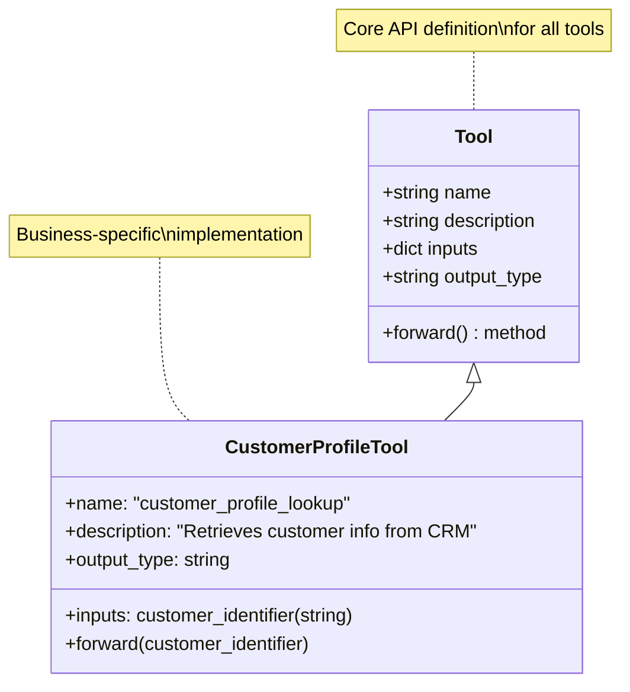

# Empowering Agents with Tools: Building Smart Solutions for Business

Welcome to this comprehensive tutorial on empowering your AI agents with tools using the Smolagent library! In the rapidly evolving landscape of AI, agents are becoming indispensable for automating complex tasks and solving real-world business challenges. But what gives an agent its "intelligence" beyond just conversational abilities? The answer lies in **tools**.

Tools are the hands and eyes of your AI agent. They allow an agent to interact with the outside world, perform calculations, access databases, send emails, or even manage customer relationships. By integrating the right tools, your agents can transform from mere conversational partners into powerful problem-solvers that drive real business value.

This tutorial will guide you through understanding, creating, and managing tools within the Smolagent framework, bridging the gap between theoretical concepts and practical business applications across various enterprise functions like Sales, Marketing, and Human Resources.

## What is a Tool?: Anatomy and API Definition

At its core, a **Tool** is a specific capability that your AI agent can use. Think of it as a specialized skill an employee might have. For an agent to effectively use this skill, it needs a clear instruction manual, or an **API (Application Programming Interface)**.

In Smolagents, a tool is defined by a few key components:

*   **`name`**: A clear, descriptive name for the tool (e.g., `web_search_tool`, `send_email`).
*   **`description`**: A plain-language explanation of what the tool does, its purpose, and how it can help the agent. This is crucial as the agent (powered by a Large Language Model) uses this description to decide when and how to invoke the tool.
*   **`inputs`**: A dictionary defining the parameters the tool accepts. Each parameter needs a `type` (e.g., `string`, `number`, `image`) and a `description` explaining what that input represents.
*   **`output_type`**: The type of data the tool returns (e.g., `string` for text, `image` for an image file).
*   **`forward` method**: This is the actual Python function containing the logic that the tool executes when called.



Let's illustrate with a business example: imagine you want an agent to look up customer profiles from your CRM system.

```python
from smolagents import Tool

class CustomerProfileLookupTool(Tool):
    # 1. Name: Clear and concise
    name = "customer_profile_lookup"
    
    # 2. Description: Explains its purpose to the agent
    description = """
    This tool retrieves detailed customer information from the CRM system based on their email or ID.
    It provides contact details, purchase history, and preference notes.
    """
    
    # 3. Inputs: Defines what parameters the tool needs
    inputs = {
        "customer_identifier": {
            "type": "string",
            "description": "The customer's email address or unique customer ID (e.g., 'john.doe@example.com' or 'CUST12345')."
        }
    }
    
    # 4. Output Type: Defines what the tool returns
    output_type = "string"

    # The actual logic that runs when the tool is called
    def forward(self, customer_identifier: str) -> str:
        # In a real scenario, this would interact with a CRM API (e.g., Salesforce, HubSpot)
        # For demonstration, we'll return mock data.
        if "john.doe@example.com" in customer_identifier:
            return "Customer: John Doe, Email: john.doe@example.com, Phone: 555-1234, Last Purchase: Laptop (2023-11-15), Preferences: Prefers tech gadgets."
        elif "jane.smith@example.com" in customer_identifier:
            return "Customer: Jane Smith, Email: jane.smith@example.com, Phone: 555-5678, Last Purchase: Marketing Software (2024-02-28), Preferences: Interested in SaaS solutions."
        else:
            return f"Customer with identifier '{customer_identifier}' not found in CRM."

# Instantiate the tool
customer_lookup_tool = CustomerProfileLookupTool()

# You can even call the tool directly to test it
print(customer_lookup_tool("john.doe@example.com"))
# Output: Customer: John Doe, Email: john.doe@example.com, Phone: 555-1234, Last Purchase: Laptop (2023-11-15), Preferences: Prefers tech gadgets.
```

This clear definition allows the agent to understand exactly what `customer_profile_lookup` does, what information it needs (a `customer_identifier`), and what kind of result it will provide (a `string`).

## Built-in Tools: Web Search, Python Interpreter, and More

Smolagents comes with a handy set of **built-in tools** that cover common, essential functionalities. These tools are ready to use, saving you time and effort when developing agents for standard tasks. To access many of these, you'll typically install `smolagents` with the `toolkit` extra:

```bash
pip install smolagents[toolkit]
```

Once installed, you can effortlessly integrate these capabilities into your agents.

### Web Search: Your Agent's Market Research Analyst

The `WebSearchTool` (or `DuckDuckGoSearchTool`/`GoogleSearchTool`) enables your agent to browse the internet, gathering real-time information. This is invaluable for tasks like market research, competitive analysis, or staying updated on industry trends.

**Business Example: Market Research Agent**

Imagine a marketing agent tasked with finding current competitor pricing for a new product launch.

```python
from smolagents import CodeAgent, InferenceClientModel, WebSearchTool

# Initialize your LLM (using a powerful model like Qwen2.5-Coder for better reasoning)
# Ensure you have your Hugging Face token set as an environment variable (HF_TOKEN)
# For local models, use TransformersModel or LiteLLMModel configured for Ollama/local LLMs
model = InferenceClientModel(model_id="Qwen/Qwen2.5-Coder-32B-Instruct")

# Instantiate the WebSearchTool
web_search = WebSearchTool()

# Create a CodeAgent and provide it with the web search tool
# CodeAgent is chosen because it allows for more complex reasoning and multi-step actions.
marketing_agent = CodeAgent(
    tools=[web_search],
    model=model,
    max_steps=5, # Limit steps for demonstration
    verbosity_level=1 # See agent's thought process
)

# Run the agent with a market research task
print("--- Marketing Agent Initiated ---")
marketing_task = "Find the current market price range for premium organic coffee beans (250g pack) in the US and identify 3 main competitors."
result = marketing_agent.run(marketing_task)

print("\n--- Marketing Agent's Findings ---")
print(result)

# Example output might include search results and a summary of pricing/competitors.
```

### Python Interpreter: Your Agent's Data Analyst

The `PythonInterpreterTool` (automatically available for `ToolCallingAgent` if `add_base_tools=True`, or native to `CodeAgent`) allows your agent to execute Python code. This is perfect for complex calculations, data manipulation, or quick scripting without leaving the agentic workflow.

**Business Example: Sales Analyst Agent**

A sales analyst agent needs to quickly calculate profit margins or forecast sales based on raw numbers.

```python
from smolagents import CodeAgent, InferenceClientModel

# Re-using the initialized model
model = InferenceClientModel(model_id="Qwen/Qwen2.5-Coder-32B-Instruct")

# For CodeAgent, the Python interpreter is built-in and implicitly available.
# We just need to ensure necessary imports are authorized if the agent needs them.
sales_agent = CodeAgent(
    tools=[], # No explicit PythonInterpreterTool needed for CodeAgent
    model=model,
    additional_authorized_imports=['math', 'decimal'], # Authorize math and decimal modules
    max_steps=3,
    verbosity_level=1
)

print("\n--- Sales Agent Initiated ---")
sales_task = "Calculate the net profit from a sale of 1500 units at $25.50 each, with a production cost of $18.25 per unit and a 10% marketing overhead on total revenue."
sales_result = sales_agent.run(sales_task)

print("\n--- Sales Agent's Calculation ---")
print(sales_result)

# Example output would show the calculated net profit.
```

Other built-in tools like `VisitWebpageTool` (for directly reading webpage content) and `WikipediaSearchTool` (for quick factual lookups) further enhance your agent's capabilities for diverse information gathering tasks.

## Crafting Your Custom Tools: From Function to Business Logic

While built-in tools are great for common tasks, the true power of agents in a business context comes from **custom tools**. These allow you to integrate agents directly into your unique workflows and proprietary systems.

### Simple Custom Tools with `@tool` Decorator

For straightforward business logic that can be encapsulated in a single Python function, the `@tool` decorator is your best friend. It automatically converts your function into a callable tool with the necessary API definition.

**Business Example: Sales Lead Scoring Agent**

A sales team needs to prioritize leads. You can create a tool that calculates a lead score based on various criteria (e.g., industry, company size, recent activity) by integrating with an internal CRM API.

```python
from smolagents import CodeAgent, InferenceClientModel, tool

# Re-using the initialized model
model = InferenceClientModel(model_id="Qwen/Qwen2.5-Coder-32B-Instruct")

@tool
def calculate_lead_score(industry: str, company_size_employees: int, recent_activity_score: int) -> int:
    """
    Calculates a lead score based on industry, company size, and recent engagement activity.
    Higher scores indicate a hotter lead.

    Args:
        industry: The industry of the lead's company (e.g., 'Tech', 'Healthcare', 'Retail').
        company_size_employees: The number of employees in the lead's company.
        recent_activity_score: A score from 1-10 indicating recent engagement (e.g., website visits, email opens).
    """
    score = 0
    # Business logic for scoring
    if industry.lower() == "tech":
        score += 30
    elif industry.lower() == "healthcare":
        score += 20
    else:
        score += 10 # Base score

    if company_size_employees > 1000:
        score += 40
    elif company_size_employees > 100:
        score += 20
    else:
        score += 10

    score += recent_activity_score * 5 # Activity score has a strong impact

    return min(score, 100) # Max score of 100

# Instantiate the tool (automatically done by @tool decorator if you call it)
# sales_lead_scorer = calculate_lead_score # You can optionally re-assign it to a variable

# Create an agent and equip it with the custom tool
sales_lead_agent = CodeAgent(
    tools=[calculate_lead_score],
    model=model,
    max_steps=3,
    verbosity_level=1
)

print("\n--- Sales Lead Scoring Agent Initiated ---")
lead_task = "Calculate the lead score for 'Acme Corp' which is in the Tech industry, has 1500 employees, and a recent activity score of 8."
lead_result = sales_lead_agent.run(lead_task)

print("\n--- Sales Lead Scoring Agent's Output ---")
print(lead_result)
# Expected output: the lead score for Acme Corp.
```

### Complex Custom Tools by Subclassing `Tool`

For more complex scenarios, where your tool might need internal state, multiple helper methods, or elaborate initialization, you'll **subclass the `Tool` class directly**. This gives you full control over its behavior.

**Business Example: HR Policy Checker Agent**

An HR agent needs to verify if an employee's request complies with company policy, which might involve accessing internal documents and applying complex rules.

```python
from smolagents import CodeAgent, InferenceClientModel, Tool
import os

class HRPolicyCheckerTool(Tool):
    name = "hr_policy_checker"
    description = """
    This tool checks an employee's request against internal HR policies.
    It can retrieve policy details and determine compliance.
    """
    inputs = {
        "policy_area": {
            "type": "string",
            "description": "The area of HR policy to check (e.g., 'leave_request', 'expense_reimbursement', 'remote_work')."
        },
        "request_details": {
            "type": "string",
            "description": "Specific details of the employee's request relevant to the policy area."
        }
    }
    output_type = "string"

    def __init__(self):
        super().__init__()
        # In a real system, this would load/connect to an internal policy knowledge base
        self.policies = {
            "leave_request": "Maximum 20 days annual leave, 5 days sick leave. Requires manager approval for >3 days.",
            "expense_reimbursement": "Receipts required for all expenses. Max $50 for meals without prior approval.",
            "remote_work": "Requires departmental approval. Must maintain productivity standards and secure internet connection."
        }
    
    # Helper method for internal logic
    def _get_policy_text(self, policy_area: str) -> str:
        return self.policies.get(policy_area, "Policy not found for this area.")

    def forward(self, policy_area: str, request_details: str) -> str:
        policy_text = self._get_policy_text(policy_area)
        if "Policy not found" in policy_text:
            return policy_text

        # Simulate compliance check based on details
        compliance_status = "Compliant"
        if policy_area == "leave_request":
            if "5 days" in request_details and "no manager approval" in request_details:
                compliance_status = "Non-compliant (missing manager approval for extended leave)."
        elif policy_area == "expense_reimbursement":
            if "meal $60" in request_details and "no receipt" in request_details:
                compliance_status = "Non-compliant (exceeded meal limit without approval and no receipt)."
        
        return f"Policy for '{policy_area}': {policy_text}\nRequest Details: {request_details}\nCompliance Status: {compliance_status}"

# Instantiate the HR policy checker tool
hr_policy_tool = HRPolicyCheckerTool()

# Create an agent for HR tasks
hr_agent = CodeAgent(
    tools=[hr_policy_tool],
    model=model,
    max_steps=3,
    verbosity_level=1
)

print("\n--- HR Policy Agent Initiated ---")
hr_task = "Check if an employee's request for 7 days of sick leave without manager approval is compliant."
hr_result = hr_agent.run(hr_task)

print("\n--- HR Policy Agent's Compliance Check ---")
print(hr_result)
# Expected output: Compliance status based on simulated policy check.
```

## Sharing and Loading Tools: The Hugging Face Hub Integration

The Hugging Face Hub isn't just for models and datasets; it's a powerful platform for sharing and collaborating on **agents and tools**! This feature is critical for enterprises looking to standardize tool usage across teams, or for developers wanting to contribute to a community of reusable agent components.

### Sharing Your Custom Tool to the Hub

Once you've built a powerful custom tool, you can easily share it to the Hugging Face Hub as a Space repository. This makes it discoverable and reusable by others (or other departments within your organization).

```python
# Assuming hr_policy_tool is already defined from the previous example
# And you are logged in via 'huggingface-cli login' or passed a token.

# Replace 'your_username' with your Hugging Face username or organization name
# Ensure your token has write access if pushing to your profile or an org.
# For demo purposes, we'll comment out the actual push.

# print("\n--- Pushing HR Policy Tool to Hub (for demonstration, won't actually run) ---")
# hr_policy_tool.push_to_hub("your_username/hr-policy-checker-tool")
# print("Tool pushed! Check it out on the Hugging Face Hub.")

# Remember, in production, you might set 'private=True' to keep internal tools secure.
```

When pushed, Smolagents automatically generates a Gradio UI for your tool, allowing anyone to test it directly from the browser!

### Loading Tools from the Hub

Just as easily, you can load tools (and agents) that have been shared on the Hub. This enables rapid prototyping and leveraging existing functionalities.

```python
from smolagents import CodeAgent, InferenceClientModel, load_tool

# Re-using the initialized model
model = InferenceClientModel(model_id="Qwen/Qwen2.5-Coder-32B-Instruct")

# Load a tool from the Hub (replace with a real tool ID if you pushed one)
# For this example, let's assume 'm-ric/text-to-image' is a public image generation tool.
# Always set `trust_remote_code=True` after verifying the tool's code, as it executes external code.
try:
    image_generation_tool = load_tool("m-ric/text-to-image", trust_remote_code=True)

    # Create an agent to use the loaded tool
    creative_agent = CodeAgent(
        tools=[image_generation_tool],
        model=model,
        max_steps=3,
        verbosity_level=1
    )

    print("\n--- Creative Agent Initiated (using Hub tool) ---")
    creative_task = "Generate a captivating image for a new marketing campaign promoting sustainable energy, featuring a futuristic city powered by solar panels and wind turbines."
    creative_result = creative_agent.run(creative_task)

    print("\n--- Creative Agent's Output ---")
    print(creative_result)
    # Expected output: path to the generated image.
except Exception as e:
    print(f"\nCould not load image generation tool from Hub. Skipping: {e}")
    print("Ensure you are connected to the internet and the tool exists.")
```

## Integrating External Toolkits: LangChain and MCP Servers

Smolagents is designed to be **tool-agnostic**, meaning it can integrate with tools from other popular frameworks and even custom microservices. This provides immense flexibility, allowing you to leverage existing investments in other AI tools or build highly distributed agent systems.

### Integrating LangChain Tools

LangChain is a widely used framework for building LLM applications, offering a rich ecosystem of integrations and tools. Smolagents can wrap LangChain tools, making them available to your Smolagents agents.

**Business Example: Industry News Monitoring Agent**

A competitive intelligence team needs an agent to monitor industry-specific news and generate summaries. You can use LangChain's `SerpAPIWrapper` (which provides search capabilities) and integrate it into your Smolagent.

```python
# !pip install langchain google-search-results  # Install LangChain and SerpAPI dependencies

from smolagents import CodeAgent, InferenceClientModel, Tool
from langchain_community.utilities import SerpAPIWrapper # Using SerpAPIWrapper for search functionality
from langchain.agents import Tool as LangChainTool # Import LangChain's Tool class to wrap it

# Initialize your LLM (same as before)
model = InferenceClientModel(model_id="Qwen/Qwen2.5-Coder-32B-Instruct")

# Set up LangChain's SerpAPIWrapper (requires SERPAPI_API_KEY environment variable)
# You can get a free API key from https://serpapi.com/
try:
    search = SerpAPIWrapper(serpapi_api_key=os.environ.get("SERPAPI_API_KEY"))

    # Define the LangChain tool
    langchain_search_tool = LangChainTool(
        name="Serp_API_Search",
        description="A search tool to find information on the internet using SerpAPI.",
        func=search.run,
    )

    # Wrap the LangChain tool into a Smolagent Tool
    smolagent_search_tool = Tool.from_langchain(langchain_search_tool)

    # Create an agent and equip it with the wrapped LangChain tool
    news_agent = CodeAgent(
        tools=[smolagent_search_tool],
        model=model,
        max_steps=5,
        verbosity_level=1
    )

    print("\n--- News Monitoring Agent Initiated (using LangChain Tool) ---")
    news_task = "Find the latest news headlines about 'AI in healthcare' from the last 24 hours and summarize the top 3 developments."
    news_result = news_agent.run(news_task)

    print("\n--- News Monitoring Agent's Summary ---")
    print(news_result)
except ImportError:
    print("\nSkipping LangChain example: 'langchain' or 'google-search-results' not installed. Please install them.")
except Exception as e:
    print(f"\nSkipping LangChain example: Could not initialize SerpAPIWrapper. Ensure SERPAPI_API_KEY is set. Error: {e}")
```

### Connecting to MCP Servers

The **Model Context Protocol (MCP)** is a standard for agents to interact with microservice-like tools running anywhere, even on remote servers. This allows for highly scalable and distributed agent architectures. Smolagents provides `MCPClient` and `ToolCollection.from_mcp` for this purpose.

**Business Example: Inventory Management Agent**

An operations agent needs to check real-time stock levels or update inventory records by interacting with an internal inventory management system exposed as an MCP server.

```python
# !pip install mcp # Install the MCP library

from smolagents import CodeAgent, InferenceClientModel, ToolCollection
import os
import subprocess
import time
from textwrap import dedent

# Re-using the initialized model
model = InferenceClientModel(model_id="Qwen/Qwen2.5-Coder-32B-Instruct")

# For demonstration, we'll start a dummy MCP server locally.
# In a real scenario, this would be a persistent service.
mcp_server_script = dedent("""
from mcp.server.fastmcp import FastMCP

mcp = FastMCP("Inventory Management Server", host="127.0.0.1", port=8000)

@mcp.tool()
def check_stock_level(product_id: str) -> str:
    \"\"\"Checks the current stock level for a given product ID.\"\"\"
    # Mock stock data
    stock = {"P001": 150, "P002": 30, "P003": 0}
    level = stock.get(product_id, -1)
    if level != -1:
        return f"Product {product_id}: {level} units in stock."
    return f"Product {product_id} not found."

@mcp.tool()
def update_stock(product_id: str, quantity_change: int) -> str:
    \"\"\"Updates the stock level for a product by adding/removing quantity.\"\"\"
    # In a real system, this would interact with a database
    return f"Stock for {product_id} updated by {quantity_change}. (Mock confirmation)"

mcp.run(transport="streamable-http")
""").strip()

server_process = None
try:
    print("\n--- Starting Dummy MCP Server ---")
    # Start the MCP server in a separate process
    server_process = subprocess.Popen(["python", "-c", mcp_server_script])
    time.sleep(2) # Give server time to start

    # Connect to the MCP server and load its tools
    # Always set `trust_remote_code=True` after verifying the server's tools,
    # as it executes external code on your local machine.
    with ToolCollection.from_mcp({"url": "http://127.0.0.1:8000/mcp", "transport": "streamable-http"}, trust_remote_code=True) as inventory_tools_collection:
        inventory_agent = CodeAgent(
            tools=[*inventory_tools_collection.tools], # Unpack tools from the collection
            model=model,
            max_steps=5,
            verbosity_level=1
        )

        print("\n--- Inventory Agent Initiated (using MCP Tools) ---")
        inventory_task = "Check the stock level for product P002, then if it's below 50, order 100 more units."
        inventory_result = inventory_agent.run(inventory_task)

        print("\n--- Inventory Agent's Actions ---")
        print(inventory_result)

except ImportError:
    print("\nSkipping MCP example: 'mcp' not installed. Please install it.")
except Exception as e:
    print(f"\nSkipping MCP example: Could not start or connect to MCP server. Error: {e}")
finally:
    if server_process:
        print("\n--- Stopping Dummy MCP Server ---")
        server_process.kill() # Ensure server process is terminated
        server_process.wait()
```

## Managing Your Agent's Toolbox: Adding and Removing Capabilities

An agent's capabilities are dynamic! You might want to equip an agent with new tools for a specific project, or remove tools that are no longer relevant to streamline its focus. In Smolagents, your agent's `tools` attribute is a standard Python dictionary, making it easy to manage.

**Business Example: Dynamic Marketing Agent**

A marketing agent handles various tasks. For a special holiday campaign, you want to temporarily add a "promotional campaign tool" and then remove it after the campaign ends.

```python
from smolagents import CodeAgent, InferenceClientModel, WebSearchTool, Tool

# Re-using the initialized model
model = InferenceClientModel(model_id="Qwen/Qwen2.5-Coder-32B-Instruct")

# 1. Start with a base marketing agent with general tools
base_marketing_agent = CodeAgent(
    tools=[WebSearchTool()], # Starts with just web search
    model=model,
    max_steps=3,
    verbosity_level=1
)
print("Base Marketing Agent Tools:", list(base_marketing_agent.tools.keys()))
# Output: Base Marketing Agent Tools: ['web_search', 'final_answer']

# 2. Define a temporary "Promotional Campaign Tool"
@tool
def launch_promo_campaign(campaign_name: str, target_audience: str) -> str:
    """
    Launches a new digital promotional campaign for a specific product or service.
    Integrates with advertising platforms.

    Args:
        campaign_name: The name of the promotional campaign.
        target_audience: The demographic or segment to target (e.g., 'young adults', 'small businesses').
    """
    # In a real scenario, this would trigger an advertising platform API
    return f"Campaign '{campaign_name}' launched successfully targeting '{target_audience}'!"

# 3. Add the new tool to the agent's toolbox for the campaign period
base_marketing_agent.tools[launch_promo_campaign.name] = launch_promo_campaign

print("\nTools after adding promotional tool:", list(base_marketing_agent.tools.keys()))
# Output: Tools after adding promotional tool: ['web_search', 'final_answer', 'launch_promo_campaign']

# Now the agent can use the new tool
print("\n--- Marketing Agent launching promo campaign ---")
promo_task = "Launch a holiday season promotional campaign named 'WinterDeals2024' targeting 'families with young children'."
promo_result = base_marketing_agent.run(promo_task)
print(promo_result)
# Expected output: Confirmation of campaign launch.

# 4. After the campaign, remove the tool
del base_marketing_agent.tools[launch_promo_campaign.name]

print("\nTools after removing promotional tool:", list(base_marketing_agent.tools.keys()))
# Output: Tools after removing promotional tool: ['web_search', 'final_answer']

# The agent is now back to its general-purpose state.
```

## Conclusion

Empowering your AI agents with tools is the cornerstone of building truly intelligent and functional solutions for your business. From leveraging ready-made built-in functionalities to crafting bespoke tools that integrate with your enterprise's unique logic and external platforms, Smolagents provides the flexibility and power you need.

By following the principles outlined in this tutorial, you can enable your agents to:

*   **Perform real-world actions** like market research, data analysis, or policy compliance checks.
*   **Automate complex multi-step workflows** that span across different systems.
*   **Adapt and scale** by dynamically managing their capabilities.

The journey of building powerful agents is iterative. Start simple, expand their toolset as needed, and continuously refine their performance. The world of agentic AI is vast, and with Smolagents, you have a robust framework to navigate it and build the next generation of smart business applications.

Now, go forth and empower your agents!