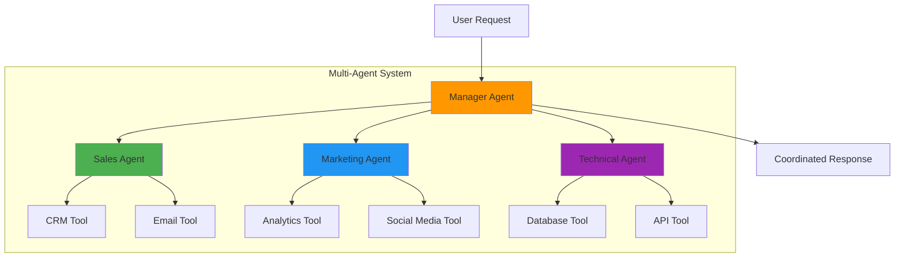

# Building Advanced Agent Architectures with Smolagents

In the dynamic landscape of AI, building sophisticated and robust agent-based systems is key to unlocking new levels of automation and intelligence. While basic agents can handle single-step tasks, real-world enterprise challenges often demand more intricate architectures: multiple agents collaborating, intelligent memory management, human oversight, and scalable deployment.

This tutorial dives deep into building advanced agent architectures using the `smolagents` library. We'll explore how to design, implement, and deploy agents that can tackle complex, multi-faceted business problems across various domains like sales, marketing, and human resources.

## Quality Standards

*   **Clarity**: We assume you have a basic understanding of Python. No prior knowledge of `smolagents` is required, though familiarity with its [introduction](docs/source/en/index.md) and [guided tour](docs/source/en/guided_tour.md) is beneficial.
*   **Completeness**: Each section is self-contained, yet builds upon previous concepts, fostering a progressive learning experience.
*   **Practical Focus**: Every concept is demonstrated through practical, working code examples.
*   **Business Relevance**: We connect technical features to tangible business outcomes, showing how `smolagents` can solve real enterprise problems.
*   **Progressive Complexity**: We start with foundational concepts and gradually introduce more advanced techniques.

## Success Metrics

By the end of this tutorial, you should be able to:
*   Design and implement multi-agent systems for complex tasks.
*   Effectively manage agent memory to retain context and learn from interactions.
*   Integrate human oversight into agent workflows for critical decision-making.
*   Develop scalable, asynchronous agent applications ready for production.

---

## 1. Orchestrating Multi-Agent Systems: Hierarchical and Collaborative Agents

### Concept: Beyond the Single Agent

Imagine a single customer support agent trying to handle every type of inquiry, from technical troubleshooting to billing disputes and marketing questions. It would be overwhelmed and inefficient. In the real world, complex problems are often solved by teams of specialized individuals collaborating. The same principle applies to AI agents.

**Multi-agent systems** involve multiple AI agents working together to achieve a common goal. This approach offers several key benefits in an enterprise context:

*   **Specialization**: Different agents can be equipped with unique tools, knowledge bases, and prompts, making them experts in specific domains (e.g., a "Sales Agent," a "Marketing Research Agent," a "Technical Support Agent").
*   **Improved Performance**: By dividing a complex problem into smaller, manageable sub-problems, each handled by a specialist, the overall system can achieve higher accuracy and efficiency.
*   **Robustness**: If one agent fails, others can potentially pick up the slack or escalate the issue, making the system more resilient.
*   **Scalability**: New agents can be added or removed as business needs evolve without redesigning the entire system.

In `smolagents`, you can build **hierarchical multi-agent systems**, where a "manager" agent orchestrates the work of several "managed" agents.

### Smolagents Approach: Manager and Managed Agents

`smolagents` simplifies multi-agent orchestration by allowing any `CodeAgent` or `ToolCallingAgent` to act as a "managed agent" for another. The core idea is to expose managed agents as callable entities (similar to tools) to the manager agent.

To enable an agent to be managed:
1.  Give it a `name` and `description` during initialization. These attributes inform the manager agent about its capabilities.
2.  Pass the managed agent instance(s) to the `managed_agents` list parameter of the manager agent.

The manager agent's prompt template (`system_prompt`) is automatically updated to inform it about its "team members" and how to interact with them via function calls.



You can find more details and examples in the `smolagents` documentation:
*   [Orchestrate a multi-agent system](docs/source/en/examples/multiagents.md)

### Business Example: A Marketing Campaign Assistant

Let's build a multi-agent system to assist with planning a social media marketing campaign for a new product launch.

**Scenario:** A marketing team wants to launch a new eco-friendly smart home device. They need assistance with researching trending topics, identifying potential influencers, and drafting initial social media post ideas.

**Agent Architecture:**
*   **Campaign Manager Agent (`CodeAgent`)**: Oversees the entire campaign planning process. It's responsible for strategic decisions and delegating tasks.
*   **Market Research Agent (`ToolCallingAgent`)**: Specializes in gathering information from the web (e.g., trending hashtags, competitor strategies, environmental news).
*   **Content Creation Agent (`CodeAgent`)**: Focuses on generating creative social media copy and content ideas.

First, let's install the necessary libraries:
```bash
pip install smolagents[toolkit] --upgrade -q
```
You'll need to set your Hugging Face API token as an environment variable (`HF_TOKEN`) for the `InferenceClientModel` to function properly.
```python
import os
from dotenv import load_dotenv
from smolagents import CodeAgent, ToolCallingAgent, InferenceClientModel, WebSearchTool, tool

# Load environment variables from a .env file (if you have one)
load_dotenv()

# --- Initialize Models ---
# We'll use InferenceClientModel for simplicity, assuming HF_TOKEN is set.
# For a production setup, consider dedicated endpoints or more robust LLM APIs.
model = InferenceClientModel(model_id="Qwen/Qwen2.5-Coder-32B-Instruct")

# --- Define Tools ---
# Market Research Agent needs a web search tool
web_search_tool = WebSearchTool()

# Content Creation Agent needs a content generation tool (simple mock for this example)
@tool
def generate_social_media_post(product_name: str, topic: str, tone: str) -> str:
    """
    Generates a social media post draft for a given product and topic.

    Args:
        product_name: The name of the product.
        topic: The main topic/theme of the post (e.g., "sustainability", "innovation").
        tone: The desired tone of the post (e.g., "enthusiastic", "informative", "humorous").
    """
    if product_name == "eco-friendly smart home device":
        if topic == "sustainability":
            return f"🌿 Introducing our {product_name}! Make your home greener with smart energy savings. #Sustainability #SmartHome"
        elif topic == "innovation":
            return f"💡 Future-proof your home with our {product_name}! Cutting-edge tech for a smarter, cleaner life. #Innovation #FutureTech"
    return f"Draft post for {product_name} about {topic} with {tone} tone."

# --- Create Managed Agents ---
# 1. Market Research Agent
market_research_agent = ToolCallingAgent(
    tools=[web_search_tool],
    model=model,
    max_steps=5, # Limit steps to avoid very long research
    name="market_research_agent",
    description="A specialist in researching market trends, competitor activities, and trending topics on the web. Provide a clear research query."
)

# 2. Content Creation Agent
content_creation_agent = CodeAgent(
    tools=[generate_social_media_post],
    model=model,
    max_steps=3, # Limit steps for content creation
    name="content_creation_agent",
    description="An expert in drafting engaging social media posts. Provide product name, topic, and desired tone."
)

# --- Create the Campaign Manager Agent ---
campaign_manager_agent = CodeAgent(
    tools=[], # Manager agent doesn't need its own tools for this example
    model=model,
    managed_agents=[market_research_agent, content_creation_agent],
    # Allow manager to import necessary Python modules for data processing if needed
    additional_authorized_imports=["json", "pandas"],
    verbosity_level=1 # Set to 2 for more detailed internal logs
)

# --- Run the Campaign Manager Agent with a Business Task ---
campaign_task = """
Plan a social media launch campaign for our new eco-friendly smart home device.
1. Research current trending topics related to sustainability, smart homes, and environmental tech.
2. Based on the research, suggest 2-3 key themes for social media posts.
3. For each theme, ask the content creation agent to draft one short, engaging post (max 140 characters, enthusiastic tone).
4. Provide a summary of the research findings and the drafted posts as the final output.
"""

print(f"\n🚀 Campaign Manager Agent starting task:\n{campaign_task}\n")

# Execute the campaign planning
final_campaign_plan = campaign_manager_agent.run(campaign_task)

print(f"\n--- Final Campaign Plan from Manager Agent ---\n{final_campaign_plan}")
```

**Explanation:**
*   The `campaign_manager_agent` receives the high-level business task.
*   It then leverages `market_research_agent` to gather information (e.g., by calling `market_research_agent("trending topics on eco-friendly technology")`).
*   Based on the research results, it might then call `content_creation_agent` multiple times, providing specific `product_name`, `topic`, and `tone` arguments for each post (e.g., `content_creation_agent(product_name="eco-friendly smart home device", topic="sustainability", tone="enthusiastic")`).
*   Finally, the manager agent synthesizes all the information into a comprehensive campaign plan, demonstrating how specialized agents collaborate under a single orchestrator.

---

## 2. Managing Agent Memory: Persistent State and Contextual Awareness

### Concept: The Agent's CRM

Just like a sales professional needs to remember past interactions, preferences, and deal statuses with a client to provide personalized service, an AI agent needs "memory" to maintain context, learn from past actions, and avoid redundant work. Without memory, an agent would treat every interaction as a fresh start, leading to fragmented conversations and inefficient task execution.

**Agent memory** is the ability of an agent to store and recall information from previous steps, including:
*   User queries and system prompts.
*   Intermediate thoughts and reasoning steps (LLM outputs).
*   Tool calls made and their observations/results.
*   Errors encountered during execution.

Effective memory management is crucial for:
*   **Contextual Awareness**: Maintaining a consistent understanding of the task and conversation history.
*   **Learning and Self-Correction**: Allowing the agent to learn from errors and refine its approach in subsequent steps.
*   **Efficiency**: Preventing repetitive actions by remembering what has already been tried or discovered.
*   **Auditability**: Providing a clear trace of the agent's decision-making process for debugging and compliance.

### Smolagents Approach: `AgentMemory` and `reset` Flag

`smolagents` provides the `AgentMemory` class (accessible via `agent.memory`) to manage the conversation history. It stores various `MemoryStep` objects (e.g., `TaskStep`, `ActionStep`, `PlanningStep`) that encapsulate the details of each interaction.

Key features for memory management in `smolagents`:
*   **`agent.memory.steps`**: A list containing all the detailed steps recorded during an agent's run.
*   **`agent.run(reset=True/False)`**: The `reset` parameter in the `run` method determines whether the agent's memory is cleared (`True`, default) or preserved (`False`) before starting a new task. Setting `reset=False` allows for multi-turn conversations or sequential task execution where context is maintained.
*   **`agent.memory.replay()`**: Useful for debugging and understanding the agent's thought process retrospectively.
*   **`step_callbacks`**: Advanced feature for dynamically modifying or reacting to memory steps.

You can find more details in the `smolagents` documentation:
*   [Manage your agent's memory](docs/source/en/tutorials/memory.md)
*   [Inspect your agent runs using telemetry](docs/source/en/tutorials/inspect_runs.md)

### Business Example: A Personalized Sales Assistant

**Scenario:** A sales assistant needs to interact with a client over several days. They should remember the client's product interests, past questions, and budget considerations to provide tailored recommendations.

**Agent Architecture:** A `CodeAgent` acting as a sales assistant, with its `memory` attribute being crucial.

```python
import os
from dotenv import load_dotenv
from smolagents import CodeAgent, InferenceClientModel, WebSearchTool, tool
from smolagents.memory import ActionStep, TaskStep, PlanningStep # Import specific memory step types
import datetime

# Load environment variables
load_dotenv()

# --- Initialize Model ---
model = InferenceClientModel(model_id="Qwen/Qwen2.5-Coder-32B-Instruct")

# --- Define Tools ---
@tool
def get_product_details(product_id: str) -> str:
    """
    Retrieves detailed information about a product from the sales database.

    Args:
        product_id: The unique identifier of the product.
    """
    products_db = {
        "P001": {"name": "Eco-Smart Thermostat", "price": 199.99, "features": ["energy saving", "remote control", "AI learning"]},
        "P002": {"name": "Solar Powered Security Camera", "price": 299.99, "features": ["wireless", "night vision", "motion detection"]},
        "P003": {"name": "Smart Irrigation System", "price": 149.99, "features": ["water efficiency", "weather adaptation", "zone control"]}
    }
    details = products_db.get(product_id)
    if details:
        return f"Product ID: {product_id}, Name: {details['name']}, Price: ${details['price']}, Features: {', '.join(details['features'])}"
    return f"Product with ID {product_id} not found."

# --- Initialize Sales Assistant Agent ---
sales_assistant_agent = CodeAgent(
    tools=[WebSearchTool(), get_product_details],
    model=model,
    max_steps=10,
    verbosity_level=1 # Set to 2 for more detailed logs for debugging
)

# --- Simulate Multi-Turn Conversation with Memory Persistence ---

print("\n--- Day 1: Initial Client Inquiry ---\n")
initial_query = "I'm interested in smart home devices. Can you tell me about energy-saving options?"
# The first run: memory is reset by default (reset=True)
response_day1 = sales_assistant_agent.run(initial_query, reset=True)
print(f"\nSales Assistant (Day 1): {response_day1}")

# Inspect memory after day 1
print(f"\n--- Day 1 Memory (after first interaction) ---")
print(f"Total steps in memory: {len(sales_assistant_agent.memory.steps)}")
# Example of inspecting a specific action step's observation
if len(sales_assistant_agent.memory.steps) > 1 and isinstance(sales_assistant_agent.memory.steps[1], ActionStep):
    print(f"First action observation: {sales_assistant_agent.memory.steps[1].observations[:50]}...")

print("\n--- Day 2: Client Follow-up with Context ---\n")
follow_up_query = "What's the price of the Eco-Smart Thermostat (Product ID P001) and how does it compare to other options?"
# Crucial: set reset=False to keep the context from Day 1
response_day2 = sales_assistant_agent.run(follow_up_query, reset=False)
print(f"\nSales Assistant (Day 2): {response_day2}")

# Inspect memory after day 2 (should include Day 1's interactions)
print(f"\n--- Day 2 Memory (replaying full history) ---")
print(f"Total steps in memory: {len(sales_assistant_agent.memory.steps)}")
# Replay the entire conversation history (for debugging/audit)
# sales_assistant_agent.memory.replay()

# Example: Clearing memory for a new client
print("\n--- Starting a new client interaction (memory reset) ---")
sales_assistant_agent.run("Tell me about basic security cameras.", reset=True)
print(f"Total steps in memory after reset: {len(sales_assistant_agent.memory.steps)}")
# The memory should now only contain the new task and subsequent steps.
```
**Explanation:**
*   The `sales_assistant_agent` is initialized once.
*   In "Day 1," it processes an initial inquiry. Its memory then holds this interaction.
*   In "Day 2," when a follow-up question is asked, `reset=False` ensures that the agent remembers the context from Day 1, allowing it to respond more effectively and avoid asking for repeated information.
*   The `agent.memory.steps` attribute allows developers to inspect the entire history, which is vital for debugging agent behavior and ensuring compliance. A final `reset=True` call simulates starting a new conversation with a different client.

---

## 3. Human-in-the-Loop: Customizing Agent Plans Interactively

### Concept: AI + Human Expertise

In many critical business processes, full automation by AI agents might be too risky or require nuanced human judgment. Human Resources, financial planning, legal document review, or sensitive customer interactions are prime examples. **Human-in-the-Loop (HITL)** workflows integrate human oversight at key decision points, allowing AI to handle repetitive tasks while humans provide crucial validation, refinement, or ethical guidance.

HITL is beneficial for:
*   **Quality Assurance**: Humans can review AI-generated plans or outputs, ensuring accuracy and alignment with complex policies or subjective criteria.
*   **Trust and Compliance**: Building confidence in AI systems by demonstrating human control and accountability.
*   **Handling Edge Cases**: Humans can step in when AI struggles with ambiguous or unforeseen situations, improving agent performance over time.
*   **Continuous Improvement**: Human feedback can be used to retrain or fine-tune agents, making them smarter.

### Smolagents Approach: Step Callbacks for Interactive Planning

`smolagents` facilitates HITL by offering flexible **step callbacks**. These are custom Python functions that can be triggered at specific points in an agent's execution cycle (e.g., after a planning step, after a tool call). This allows you to pause the agent, present information to a human, receive feedback, and even modify the agent's state or plan before it continues.

Key features for HITL:
*   **`planning_interval`**: This agent parameter dictates how often the agent should generate a high-level plan. This is a natural point for human intervention.
*   **`step_callbacks`**: A dictionary where keys are `MemoryStep` types (like `PlanningStep`) and values are callable functions. These functions execute when the specified step type occurs.
*   **`agent.interrupt()`**: A method callable within a callback to pause the agent's execution, waiting for external input or decision.

You can find more details in the `smolagents` documentation:
*   [Human-in-the-Loop: Customize agent plan interactively](docs/source/en/examples/plan_customization.md)

### Business Example: HR Policy Generator with Manager Approval

**Scenario:** An HR department needs to draft a new internal policy (e.g., for remote work, expense claims). An AI agent can generate a draft plan, but a human HR manager must review and approve/modify it before the agent proceeds to generate the full policy.

```python
import os
from dotenv import load_dotenv
from smolagents import CodeAgent, InferenceClientModel, WebSearchTool, PlanningStep
from typing import Any

# Load environment variables
load_dotenv()

# --- Initialize Model ---
model = InferenceClientModel(model_id="Qwen/Qwen2.5-Coder-32B-Instruct")

# --- Define Tools (if any, for policy generation agent) ---
# For simplicity, our agent just plans, it doesn't execute policy generation in this example
# A real agent might have tools for document generation, legal research etc.
# web_search_tool = WebSearchTool()

# --- Define the Human-in-the-Loop Callback ---
def hr_manager_review_callback(memory_step: PlanningStep, agent: CodeAgent) -> None:
    """
    This callback is triggered after the agent creates a planning step.
    It allows an HR manager to review and modify the plan.
    """
    if isinstance(memory_step, PlanningStep):
        print("\n" + "="*80)
        print("🤖 AGENT POLICY PLAN DRAFTED - AWAITING HR MANAGER REVIEW")
        print("="*80)
        print(f"Agent's Draft Plan for Policy: {agent.task}\n")
        print(memory_step.plan)
        print("="*80)

        while True:
            choice = input("\nHR Manager: Review the plan. Options:\n1. Approve & Continue\n2. Modify Plan\n3. Cancel Agent Task\nYour choice (1-3): ").strip()
            if choice == '1':
                print("\n✅ Plan approved by HR Manager. Agent continuing execution...")
                return # Allows the agent to continue
            elif choice == '2':
                print("\n--- MODIFYING PLAN ---")
                print("Enter your revised plan. Type 'END' on a new line to finish editing.")
                modified_lines = []
                while True:
                    line = input()
                    if line.strip().upper() == 'END':
                        break
                    modified_lines.append(line)
                modified_plan = "\n".join(modified_lines).strip()
                if modified_plan:
                    memory_step.plan = modified_plan # Update the plan in memory
                    print("\n📝 Plan updated by HR Manager. Agent will use this revised plan.")
                    print(f"\nNew Plan:\n{modified_plan}\n")
                    return # Allows the agent to continue with the modified plan
                else:
                    print("No modifications entered. Please try again or approve the original plan.")
            elif choice == '3':
                print("\n❌ HR Manager cancelled the agent task.")
                agent.interrupt() # Interrupts the agent's execution
                return
            else:
                print("Invalid choice. Please enter 1, 2, or 3.")

# --- Initialize HR Policy Agent with HITL ---
hr_policy_agent = CodeAgent(
    tools=[], # Tools for policy generation would go here in a real scenario
    model=model,
    max_steps=5, # Short max_steps for demo, as we focus on planning phase
    planning_interval=1, # Generate a plan at the very first step
    step_callbacks={PlanningStep: hr_manager_review_callback}, # Register the HITL callback for planning steps
    verbosity_level=1 # Keep logs concise for demo focusing on HITL
)

# --- Run the Agent with a Policy Generation Task ---
policy_task = "Draft an initial plan for a new company policy on 'Flexible Work Arrangements', covering eligibility, application process, and communication guidelines. Focus on key sections and bullet points."

print(f"\n🚀 HR Policy Agent starting task: '{policy_task}'\n")

try:
    final_policy_plan_output = hr_policy_agent.run(policy_task)
    print(f"\n--- Final Agent Output (after Human Review) ---\n{final_policy_plan_output}")
except Exception as e:
    if "interrupted" in str(e).lower():
        print("\nAgent task was successfully cancelled by the HR Manager.")
    else:
        print(f"\nAn unexpected error occurred: {e}")
```
**Explanation:**
*   The `hr_policy_agent` is instructed to generate a plan (`planning_interval=1`).
*   Immediately after the agent generates its initial plan, the `hr_manager_review_callback` function is triggered.
*   This callback pauses the agent's execution and presents the draft plan to the "HR Manager" (the user running the script).
*   The manager can then choose to `Approve`, `Modify`, or `Cancel` the plan.
*   If "Modify" is chosen, the human can directly edit the plan, and the agent's `memory_step.plan` is updated.
*   If "Cancel" is chosen, `agent.interrupt()` is called, stopping the agent's run.
This demonstrates a powerful way to ensure human oversight and control over AI-generated strategic outputs in sensitive business domains.

---

## 4. Asynchronous Agent Applications: Building Scalable Solutions

### Concept: Handling Concurrent Demands

In modern enterprise applications, especially customer-facing services like chatbots, lead qualification systems, or dynamic pricing engines, responsiveness and scalability are paramount. If an AI agent performs complex, time-consuming tasks synchronously (blocking), it can cripple the application's ability to handle multiple concurrent requests, leading to slow response times and poor user experience.

**Asynchronous programming** allows a program to initiate a long-running operation (like an agent run) and then continue executing other tasks instead of waiting for the operation to complete. When the long-running operation finishes, it notifies the program, which can then process its result. This is crucial for:

*   **Scalability**: Handling a large number of concurrent user requests without significant performance degradation.
*   **Responsiveness**: Ensuring the main application (e.g., a web server UI) remains fluid and responsive, even when complex backend AI tasks are running.
*   **Efficient Resource Utilization**: Maximizing the use of CPU and I/O resources.

### Smolagents Approach: Integrating with Async Frameworks

`smolagents` agents, by default, run synchronously. However, they can be easily integrated into asynchronous Python applications (like those built with Starlette, FastAPI, or asyncio) using Python's `anyio.to_thread.run_sync` utility. This function offloads a synchronous function call to a separate thread, preventing it from blocking the main asynchronous event loop.

You can find more details and examples in the `smolagents` documentation:
*   [Async Applications with Agents](docs/source/en/examples/async_agent.md)

### Business Example: Real-Time Lead Qualification Chatbot

**Scenario:** A marketing website features a chatbot that qualifies leads by asking a series of questions and performing complex backend logic (e.g., searching CRM, checking company databases) to score the lead. This process can be slow. To ensure a smooth user experience, the chatbot must remain responsive while the lead qualification runs in the background.

```python
import anyio.to_thread
from starlette.applications import Starlette
from starlette.requests import Request
from starlette.responses import JSONResponse
from starlette.routing import Route
import uvicorn
import os
from dotenv import load_dotenv
from smolagents import CodeAgent, InferenceClientModel, WebSearchTool, tool

# Load environment variables
load_dotenv()

# --- Initialize Model ---
model = InferenceClientModel(model_id="Qwen/Qwen2.5-Coder-32B-Instruct")

# --- Define Tools for Lead Qualification Agent ---
@tool
def check_crm_for_lead_history(company_name: str) -> str:
    """
    Checks the CRM system for past interactions and lead score for a given company.

    Args:
        company_name: The name of the company to look up.
    """
    # Simulate a time-consuming CRM lookup
    import time
    time.sleep(2) # Simulate network latency or complex query
    crm_data = {
        "Acme Corp": {"score": "High", "last_interaction": "2023-10-01"},
        "Innovate Inc": {"score": "Medium", "last_interaction": "2024-03-15"},
        "Global Solutions": {"score": "Low", "last_interaction": "2023-01-20"}
    }
    details = crm_data.get(company_name)
    if details:
        return f"CRM History for {company_name}: Score {details['score']}, Last interaction {details['last_interaction']}"
    return f"No CRM history found for {company_name}."

@tool
def industry_trend_analysis(industry: str) -> str:
    """
    Performs a quick analysis of recent industry trends relevant to the lead.

    Args:
        industry: The industry of the lead (e.g., "fintech", "healthcare").
    """
    # Simulate another time-consuming external API call
    import time
    time.sleep(1.5)
    trends_data = {
        "fintech": "Rapid adoption of AI in payment systems.",
        "healthcare": "Focus on telemedicine and personalized medicine.",
        "manufacturing": "Increased automation and supply chain resilience."
    }
    trend = trends_data.get(industry)
    if trend:
        return f"Industry Trends ({industry}): {trend}"
    return f"No specific trend data for {industry}."

# --- Create the Lead Qualification Agent (synchronous by nature) ---
lead_qualification_agent = CodeAgent(
    tools=[check_crm_for_lead_history, industry_trend_analysis],
    model=model,
    max_steps=5,
    verbosity_level=1 # Keep logs concise in the background
)

# --- Asynchronous Starlette Application ---
# This part represents your web server that interacts with the user.

async def qualify_lead_endpoint(request: Request):
    """
    API endpoint to qualify a lead. This is an asynchronous function.
    The agent's synchronous 'run' method is offloaded to a thread.
    """
    data = await request.json()
    lead_question = data.get("question")

    if not lead_question:
        return JSONResponse({"error": "Please provide a 'question' for lead qualification."}, status_code=400)

    print(f"\nReceived async request for lead qualification: '{lead_question}'")
    
    # --- CRUCIAL ASYNC INTEGRATION ---
    # Run the synchronous agent.run() method in a separate thread.
    # This prevents the agent from blocking the main Starlette event loop,
    # ensuring the web server remains responsive to other requests.
    try:
        qualification_result = await anyio.to_thread.run_sync(
            lead_qualification_agent.run,
            lead_question
        )
        print(f"Agent finished synchronous task for: '{lead_question}'")
        return JSONResponse({"qualification_status": qualification_result})
    except Exception as e:
        print(f"Error during lead qualification: {e}")
        return JSONResponse({"error": f"Failed to qualify lead: {str(e)}"}, status_code=500)

# Define application routes
routes = [
    Route("/qualify-lead", qualify_lead_endpoint, methods=["POST"]),
]

app = Starlette(debug=True, routes=routes)

# To run this example:
# 1. Save the code as `async_lead_qualifier.py`
# 2. Run from your terminal: `uvicorn async_lead_qualifier:app --reload`
# 3. Test with curl (in a new terminal, while uvicorn is running):
#    curl -X POST http://127.0.0.1:8000/qualify-lead -H 'Content-Type: application/json' -d '{"question": "Qualify a lead from Acme Corp interested in AI solutions for manufacturing. Find their CRM history and relevant industry trends."}'
#    (You can open multiple curl commands simultaneously to see non-blocking behavior)
```
**Explanation:**
*   The `lead_qualification_agent` is initialized with tools that simulate time-consuming backend operations (`check_crm_for_lead_history`, `industry_trend_analysis`).
*   The `qualify_lead_endpoint` in the Starlette application is an `async` function. When it receives a request, it calls `await anyio.to_thread.run_sync(lead_qualification_agent.run, lead_question)`.
*   This ensures that the potentially long-running `lead_qualification_agent.run()` (which is synchronous) does not block Starlette's main event loop. The web server can immediately accept other incoming `qualify-lead` requests, providing a smooth experience for multiple concurrent users.
*   This pattern is essential for building scalable AI services.

---

## Conclusion

This tutorial has guided you through building advanced agent architectures using `smolagents`. You've learned how to:

*   **Orchestrate Multi-Agent Systems** to tackle complex tasks by leveraging specialized agents in a collaborative hierarchy, improving efficiency and performance.
*   **Manage Agent Memory** effectively, enabling agents to maintain context, learn from past interactions, and provide more personalized and consistent experiences.
*   Implement **Human-in-the-Loop Workflows** for critical business processes, combining AI automation with essential human oversight and ethical control.
*   Develop **Asynchronous Agent Applications** to build scalable and responsive AI services capable of handling high concurrent demands in real-time.

By applying these advanced techniques, you are now equipped to design and deploy `smolagents` solutions that are not only functional but also robust, scalable, and tailored to the intricate demands of enterprise environments. Continue experimenting with different models, tools, and orchestration patterns to unlock the full potential of agentic AI in your organization.

---