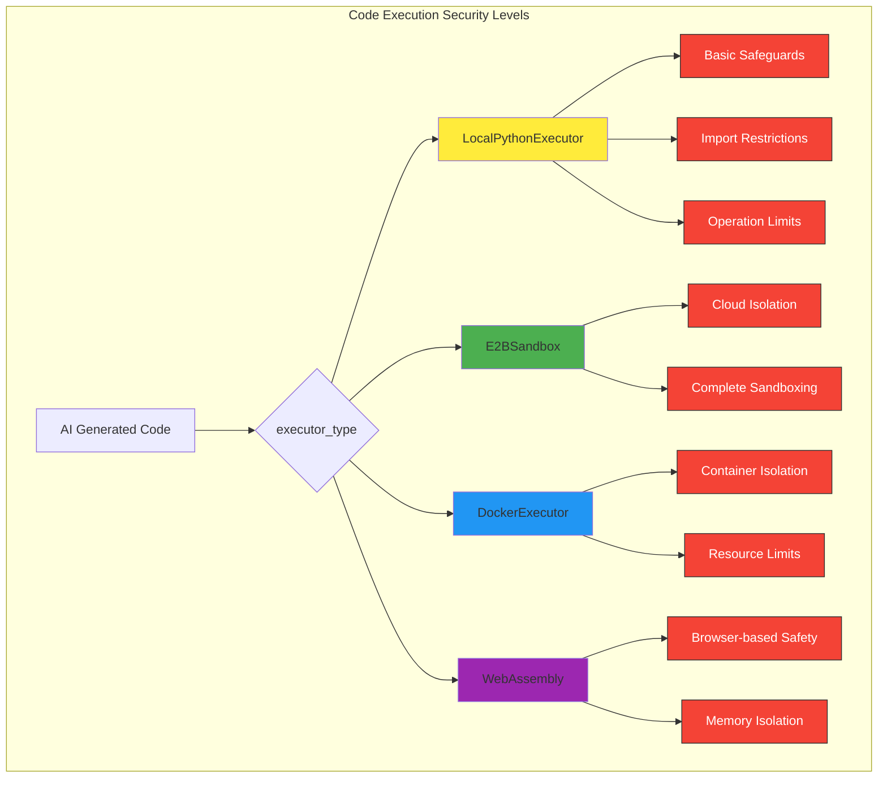

# Ensuring Your Agents are Production-Ready: Security, Monitoring, and User Experience with Smolagents

In the rapidly evolving world of AI, building a functional agent is just the first step. To truly harness the power of AI in an enterprise setting, your agents must be robust, secure, and user-friendly. This tutorial guides you through making your Smolagents production-ready, covering critical aspects like secure code execution, robust monitoring, and intuitive user interfaces.

We'll bridge the gap between theoretical concepts and real-world business applications, demonstrating how Smolagent features translate into tangible benefits for departments like HR, Marketing, and Sales.

## 1. Secure Code Execution for AI Agents

AI agents often generate and execute code dynamically to accomplish tasks. While incredibly powerful, this capability introduces significant security risks. Malicious code, accidental data exposure, or system compromise are serious concerns, especially when agents interact with sensitive company data or internal systems.

Smolagents addresses this by offering various sandboxing options to isolate code execution, ensuring your enterprise data remains secure.

### The Risk: A Practical Example for HR

Imagine an **HR agent** designed to automate employee queries, such as "How many leave days do I have left?" or "What's the policy on remote work?". This agent might need to access an internal HR system (e.g., a database or an API) to fetch relevant information.

If this agent were to execute arbitrary, unsandboxed code generated by an LLM, a simple prompt injection attack could potentially lead to:
*   **Data Exfiltration:** An attacker injects a command that reads and transmits sensitive employee data (salaries, personal details) outside the company network.
*   **System Compromise:** Malicious code attempts to access other internal systems or install malware, creating a backdoor into your infrastructure.

This highlights why sandboxing is not just a best practice, but a necessity for enterprise AI agents.

### Smolagent's Solution: The `executor_type` Parameter

Smolagents' `CodeAgent` comes with a powerful `executor_type` parameter, allowing you to choose how and where the generated Python code is executed.



#### 1.1. Local Python Executor (with Cautions)

By default, the `CodeAgent` uses a `LocalPythonExecutor`. This isn't a "raw" Python interpreter. It's built with basic safeguards:
*   **Restricted Imports:** Only a predefined safe list of modules (like `math`, `time`) are allowed by default. You can explicitly authorize more.
*   **Operation Limits:** Prevents infinite loops or excessive resource consumption.
*   **Dunder Attribute Protection:** Blocks access to potentially dangerous Python "magic" methods.

However, for highly sensitive data or untrusted inputs, it's crucial to understand that no local sandbox is 100% foolproof. A sophisticated attacker might find vulnerabilities.

**Example: Simple Calculation (Safe Context)**

Let's use an HR agent to perform a basic calculation. In this simplified example, the risk is low because we are only performing arithmetic operations and not interacting with external systems or sensitive data.

```python
from smolagents import CodeAgent, InferenceClientModel

# Initialize a model for the agent (e.g., using Hugging Face Inference API)
# Replace with your actual model ID and token
model = InferenceClientModel(model_id="Qwen/Qwen2.5-Coder-32B-Instruct")

# Create a CodeAgent using the default local executor
# No additional imports are needed for this simple task
hr_agent = CodeAgent(tools=[], model=model)

# HR task: Calculate employee's pro-rata leave days
task_hr = "An employee joined on March 15th and the company's leave year starts on January 1st. If the employee is entitled to 20 leave days annually, how many pro-rata leave days are they entitled to for this year (assuming a 365-day year)? Provide the answer rounded to 2 decimal places."

print(f"HR Agent calculates: {task_hr}")
result = hr_agent.run(task_hr)
print(f"Result: {result}")
# Expected output might be around 14.52 days
```

#### 1.2. Docker Sandbox

For a more robust isolation, Docker containers provide a secure, isolated environment for code execution. Each agent run can happen within its own lightweight container, preventing any code from affecting your host system or other containers.

**Business Relevance:** An **HR agent** needs to calculate complex benefits based on external regulations or dynamic data sources. This calculation logic can be executed within a Docker sandbox, ensuring that even if the generated code attempts to do something malicious, it's confined to the container.

**Example: Sandboxed Leave Calculation**

First, ensure Docker is installed and running on your system.
Then, you can simply set `executor_type="docker"`:

```python
from smolagents import CodeAgent, InferenceClientModel, WebSearchTool # WebSearchTool might be used for regulations

# Initialize your model
model = InferenceClientModel(model_id="Qwen/Qwen2.5-Coder-32B-Instruct")

# Create an HR agent with Docker for sandboxed code execution
# It can use a WebSearchTool to look up regulations if needed
hr_agent_docker = CodeAgent(
    tools=[WebSearchTool()], # Add tools relevant to your HR agent's tasks
    model=model,
    executor_type="docker", # Use Docker for sandboxed execution
    additional_authorized_imports=["datetime", "math"], # Safely allow common libraries
    max_steps=5 # Limit steps for demo
)

# HR task: Calculate benefits requiring potentially complex logic or external data
task_benefits = "An employee is eligible for a bonus based on their tenure. They joined on 2022-01-01 and today is 2024-07-26. The bonus is $1000 per full year of service. How much bonus are they entitled to? Make sure to use exact dates and calculate the full years of service."

print(f"HR Agent (Docker sandbox) calculates: {task_benefits}")
with hr_agent_docker: # Using 'with' statement ensures proper container cleanup
    result_docker = hr_agent_docker.run(task_benefits)
print(f"Result (Docker): {result_docker}")
```
Even if the agent were to generate a problematic `os.system('rm -rf /')` command, Docker would prevent it from affecting your host machine.

#### 1.3. E2B Sandbox

E2B provides a cloud-based, managed sandbox environment. This is ideal for enterprises that prefer offloading the management of execution environments to a third-party service, guaranteeing consistent and secure environments without local setup overhead.

**Business Relevance:** A **Marketing agent** analyzes market trends and generates custom reports, potentially involving complex data manipulation or interaction with third-party APIs (e.g., social media analytics, competitor data). Executing these operations in an E2B sandbox ensures that API keys and proprietary data are processed in a highly secure, isolated cloud environment.

**Example: Market Research Analysis in E2B**

First, sign up for E2B and set your `E2B_API_KEY` environment variable.

```python
import os
from smolagents import CodeAgent, InferenceClientModel, WebSearchTool

# Ensure your E2B_API_KEY is set in your environment variables
# os.environ["E2B_API_KEY"] = "YOUR_E2B_API_KEY"

model = InferenceClientModel(model_id="Qwen/Qwen2.5-Coder-32B-Instruct")

# Marketing agent using E2B for secure, cloud-based analysis
marketing_agent_e2b = CodeAgent(
    tools=[WebSearchTool()], # To research market data
    model=model,
    executor_type="e2b", # Use E2B for cloud sandboxing
    additional_authorized_imports=["pandas", "numpy", "matplotlib.pyplot"], # Commonly used for data analysis
    max_steps=7
)

# Marketing task: Analyze market share data
task_market_analysis = "Search for the latest market share data for smartphones globally. Summarize the top 3 manufacturers and their market share percentages. Analyze the trend over the last 3 years if data is available."

print(f"Marketing Agent (E2B sandbox) analyzes: {task_market_analysis}")
with marketing_agent_e2b: # 'with' statement ensures E2B sandbox is properly managed
    result_e2b = marketing_agent_e2b.run(task_market_analysis)
print(f"Result (E2B): {result_e2b}")
```

#### 1.4. WebAssembly Sandbox

WebAssembly (Wasm) offers a secure and fast sandbox for executing code, often in browser-like environments. While less common for typical backend enterprise agents, it's a powerful option for scenarios requiring very lightweight, client-side, or edge computation with strong isolation.

```python
from smolagents import CodeAgent, InferenceClientModel

# Initialize your model
model = InferenceClientModel(model_id="Qwen/Qwen2.5-Coder-32B-Instruct")

# Create an agent using WebAssembly for sandboxed execution
# Wasm currently has more limitations on available packages and network access
# than Docker or E2B. It's ideal for pure computational tasks.
wasm_agent = CodeAgent(
    tools=[], # Tools might be limited in Wasm context
    model=model,
    executor_type="wasm", # Use WebAssembly for sandboxing
    # additional_authorized_imports=[] # Wasm environment has limited default imports
    max_steps=3
)

# Task: Perform a complex mathematical calculation
task_wasm = "Calculate the square root of 123456789 and then cube the result. Provide the final number rounded to 5 decimal places."

print(f"Wasm Agent calculates: {task_wasm}")
with wasm_agent: # 'with' statement ensures Wasm sandbox is properly managed
    result_wasm = wasm_agent.run(task_wasm)
print(f"Result (Wasm): {result_wasm}")
```

## 2. Security Best Practices for Agent Deployments

Beyond choosing the right sandboxing mechanism, implementing broader security best practices is crucial for enterprise-grade AI agent deployments.

*   **Principle of Least Privilege:**
    *   **Concept:** Grant your agents and their tools only the minimum permissions and access necessary to perform their designated tasks.
    *   **Business Relevance:** If a **Sales agent** automates CRM updates, it should only have write access to specific lead fields, not the entire customer database. This limits damage if the agent is compromised.
    *   **Implementation:** Carefully select and configure the `additional_authorized_imports` for `CodeAgent`. Restrict external tool access as much as possible.

*   **Input Validation & Sanitization:**
    *   **Concept:** Sanitize all inputs to the agent (user prompts, data from external APIs) to prevent prompt injection attacks, where malicious instructions are embedded in the input.
    *   **Business Relevance:** A **Marketing agent** processing customer feedback from a public forum needs robust input validation to prevent an attacker from injecting commands that could compromise the agent or extract data.
    *   **Implementation:** While Smolagents handles some parsing internally, custom input validation layers can be added before passing prompts to the agent, especially for public-facing applications.

*   **Secure Credential Management:**
    *   **Concept:** Never hardcode API keys, tokens, or other sensitive credentials directly in your code. Use environment variables, secure vaults (e.g., AWS Secrets Manager, Azure Key Vault), or dedicated secret management services.
    *   **Business Relevance:** Protecting access to critical enterprise systems (CRM, ERP, payment gateways) from accidental exposure or unauthorized access.
    *   **Implementation:** Smolagents models (like `InferenceClientModel`, `LiteLLMModel`) support fetching API keys from environment variables.

    ```python
    import os
    from smolagents import InferenceClientModel

    # Load environment variables from a .env file (for local development)
    # In production, use your deployment environment's secure secrets management
    # from dotenv import load_dotenv
    # load_dotenv()

    # Access API key from environment variable, NOT hardcoded
    hf_token = os.getenv("HF_TOKEN") 
    # Example for other providers:
    # openai_api_key = os.getenv("OPENAI_API_KEY")

    # Initialize model using securely managed API key
    model_secure = InferenceClientModel(
        model_id="Qwen/Qwen2.5-Coder-32B-Instruct",
        token=hf_token # Pass token from environment variable
    )

    # Now use model_secure in your agent
    # agent_secure = CodeAgent(tools=[], model=model_secure)
    # agent_secure.run("Perform a sensitive task.")
    ```

*   **Regular Audits & Updates:**
    *   **Concept:** Regularly review your agent's code, dependencies, and models for vulnerabilities. Keep all components updated to patch known security flaws.
    *   **Business Relevance:** Staying ahead of emerging threats and maintaining compliance with security standards (e.g., ISO 27001, GDPR).
    *   **Implementation:** Integrate agent code into your CI/CD pipelines with static analysis tools. Monitor official releases of Smolagents and its dependencies.

## 3. Inspecting Agent Runs: Monitoring with OpenTelemetry

Agent-based systems, by their very nature, can be complex and unpredictable. They involve multiple steps, tool calls, and interactions, making traditional debugging challenging. To effectively understand, troubleshoot, and optimize agent performance in production, robust observability is essential.

Smolagents integrates with **OpenTelemetry**, a standardized framework for collecting telemetry data (traces, metrics, logs). This allows you to trace agent runs, understand their decision-making process, and identify bottlenecks or failures.

### The Need for Observability: A Marketing Campaign Example

Consider a **Marketing agent** tasked with generating personalized ad copy for various customer segments. If an ad campaign performs poorly or produces an inappropriate message, you need to answer questions like:
*   Did the agent retrieve the correct customer data?
*   Did it use the right tone and keywords?
*   Did it get stuck in a loop or hallucinate information?
*   Which LLM calls contributed the most to the cost or latency?

OpenTelemetry-based monitoring provides the answers by offering a detailed, step-by-step trace of the agent's execution.

### Setting up Telemetry with Smolagents and Phoenix/Langfuse

Smolagents leverages the `openinference-instrumentation-smolagents` library, which integrates seamlessly with OpenTelemetry collectors and platforms like Arize AI Phoenix or Langfuse.

#### 3.1. Install Dependencies

First, install Smolagents with the `telemetry` extra, along with your chosen observability platform (e.g., Phoenix for local inspection).

```bash
pip install 'smolagents[telemetry,toolkit]' # toolkit for web search tool
pip install phoenix # For local visualization of traces
# Or for Langfuse: pip install langfuse
```

#### 3.2. Run the OpenTelemetry Collector (Phoenix Example)

For local development and debugging, you can run the Phoenix collector in the background.

```bash
# In your terminal (keep this running)
python -m phoenix.server.main serve
```

#### 3.3. Instrument Your Agent

Now, instrument your agent code to automatically send traces to the collector.

```python
from phoenix.otel import register
from openinference.instrumentation.smolagents import SmolagentsInstrumentor

# Register OpenTelemetry resource and configure instrumentation
register()
SmolagentsInstrumentor().instrument()

from smolagents import CodeAgent, InferenceClientModel, WebSearchTool, ToolCallingAgent, VisitWebpageTool

# Initialize models
model = InferenceClientModel(model_id="Qwen/Qwen2.5-Coder-32B-Instruct")

# Define a specialized Web Research Agent (as a managed agent)
web_research_agent = ToolCallingAgent(
    tools=[WebSearchTool(), VisitWebpageTool()],
    model=model,
    name="web_research_agent",
    description="An agent specialized in conducting web searches and visiting webpages to gather information.",
    max_steps=5 # Limit steps for demo clarity
)

# Define the main Marketing Campaign Agent
marketing_campaign_agent = CodeAgent(
    tools=[], # Main agent orchestrates, doesn't directly use web tools
    model=model,
    managed_agents=[web_research_agent], # Can delegate web research to sub-agent
    additional_authorized_imports=["pandas", "requests"], # Allow data manipulation
    max_steps=10 # Max steps for the overall task
)

# Marketing task: Generate ad copy based on competitor analysis
task_ad_copy = "Research current ad campaigns of 'CompanyX' and 'CompanyY' for their new product 'ProductZ'. Identify their key messaging, target audience, and call-to-actions. Based on this, suggest 3 unique ad headlines for our new 'SimilarProduct' that highlights its eco-friendliness."

print(f"Marketing Agent starts ad copy generation: {task_ad_copy}")
marketing_campaign_agent.run(task_ad_copy)
print("Marketing Agent task completed. Check Phoenix UI for traces.")

```

#### 3.4. Inspect Traces

After running the agent, open your web browser and navigate to `http://0.0.0.0:6006/projects/`. You will see detailed traces of your agent's execution, including:
*   Each LLM call.
*   Each tool execution (e.g., `web_research_agent` being called).
*   Input and output of each step.
*   Latency and token usage.

This allows you to visually inspect the agent's reasoning path, identify where it spent time, and understand how it arrived at its conclusions – or where it went wrong. This is invaluable for debugging, performance optimization, and ensuring your agents meet business objectives.

## 4. Interactive Agent UIs: Building and Deploying with Gradio

For agents to be adopted by non-technical business users (e.g., Sales, HR, Customer Support), a friendly and intuitive user interface is critical. Gradio is an excellent library for quickly building interactive web UIs for your AI models and agents. Smolagents provides seamless integration with Gradio via its `GradioUI` class.

### The Need for User Experience: A Sales Support Agent

Imagine a **Sales Support agent** designed to help sales representatives quickly pull up product specifications, pricing, or competitive comparisons during a client call. Sales reps are focused on closing deals, not writing Python code. A simple, chat-like interface allows them to:
*   **Query naturally:** "What's the price of Product A in Europe?"
*   **Receive instant answers:** Displayed clearly in a chat window.
*   **Upload relevant files:** "Here's the client's requirement document, can you summarize it?"

This enhances productivity and empowers sales teams without requiring them to become AI experts.

### Building and Deploying with Gradio

The `GradioUI` class simplifies creating a web interface for any `MultiStepAgent`.

**Example: Sales Support Agent with Gradio UI**

Let's create a simple Sales Support agent that can answer product-related questions by searching the web, and then wrap it in a Gradio UI.

```python
from smolagents import CodeAgent, InferenceClientModel, WebSearchTool, GradioUI

# Initialize your model
model = InferenceClientModel(model_id="Qwen/Qwen2.5-Coder-32B-Instruct")

# Create a Sales Support Agent that can search the web
sales_support_agent = CodeAgent(
    tools=[WebSearchTool()], # Allow the agent to search for product info
    model=model,
    max_steps=5, # Limit steps for quick responses
    stream_outputs=True # Enable streaming for real-time updates in UI
)

# Create a Gradio UI for the Sales Support Agent
# 'file_upload_folder' allows users to upload documents (e.g., product brochures, client requirements)
# 'reset_agent_memory=False' allows for continuous conversation
sales_ui = GradioUI(
    agent=sales_support_agent,
    file_upload_folder="./sales_uploads", # Folder to save uploaded files
    reset_agent_memory=False # Keep conversation history
)

print("Launching Gradio UI for Sales Support Agent...")
print("Access the UI at the URL provided after execution starts (usually http://127.0.0.1:7860)")

# Launch the Gradio application
# In a real-world scenario, you might deploy this to a Hugging Face Space or a cloud platform.
sales_ui.launch(share=False) # Set share=True to get a public link (for demos)
```
After running this code, open your web browser to the local URL provided (e.g., `http://127.0.0.1:7860`). You can now interact with your Sales Support Agent, asking questions like:
*   "What are the key features of the latest 'Quantum Laptop' model?"
*   "Compare 'Cloud CRM Pro' with 'Enterprise CRM Suite' in terms of pricing and features."

The `stream_outputs=True` in `CodeAgent` will provide real-time updates in the Gradio chat interface, showing the agent's thoughts and tool calls as it processes the request, offering transparency to the user.

## Conclusion

Ensuring your AI agents are production-ready is paramount for successful enterprise adoption. By mastering secure code execution with various sandboxing options, adhering to best practices for deployment, leveraging powerful monitoring tools like OpenTelemetry, and building intuitive user interfaces with Gradio, you can confidently deploy and scale your Smolagent solutions.

These capabilities transform experimental prototypes into reliable, secure, and valuable assets that drive efficiency and innovation across your organization, from HR and Marketing to Sales and beyond. Start integrating these principles today to unlock the full potential of AI in your business.