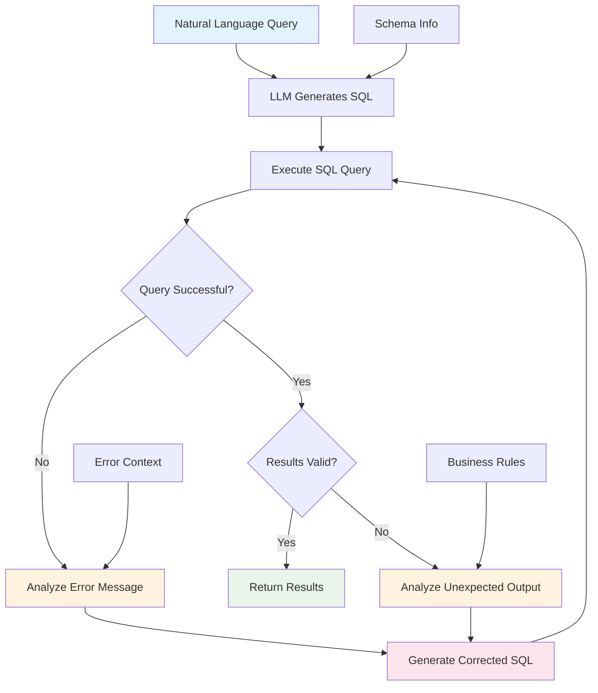

---
layout: default
title: Real-world Applications
---

# Real-world Applications & Case Studies with Smolagents

Welcome to the exciting world of `smolagents`! This tutorial moves beyond the basics to show you how to apply `smolagents` to solve real-world business challenges. We'll explore practical case studies, demonstrating how intelligent agents can enhance accuracy, efficiency, and decision-making across various enterprise functions like sales, marketing, and HR.

By the end of this tutorial, you'll understand:
*   How to build `smolagents` solutions for complex business problems.
*   Strategies for optimizing agent performance for specific use cases.
*   Techniques for selecting and integrating different Large Language Models (LLMs) to balance performance and cost.

Let's dive in!

## 1. Self-Correcting Text-to-SQL Agents: Ensuring Data Accuracy

**Business Problem:** In many organizations, accessing specific data often requires a data analyst or engineer to write SQL queries. This can create bottlenecks and delays, especially for business users (e.g., sales managers, HR personnel) who need quick insights but don't have SQL expertise. A common issue is that LLMs might generate incorrect SQL, leading to wrong insights without immediate detection.

**Smolagents Solution:** We can build a `smolagents` system that interprets natural language questions, generates SQL queries, executes them against a database, and, crucially, **self-corrects** if the query or its results are inaccurate. This ensures data accuracy and empowers business users to retrieve precise information independently.

**Example: Sales Performance Analysis**
Imagine a sales manager who wants to know: "Which sales representative achieved the highest total revenue last quarter?"

Here's how a `smolagents` powered Text-to-SQL agent can handle this:

1.  **Natural Language Input:** The sales manager types their question.
2.  **SQL Generation:** The agent (powered by an LLM) interprets the question and generates a SQL query (e.g., `SELECT sales_rep, SUM(revenue) AS total_revenue FROM sales_data WHERE quarter='Q1' GROUP BY sales_rep ORDER BY total_revenue DESC LIMIT 1;`).
3.  **Execution & Validation:** The agent executes the SQL query against the sales database.
4.  **Self-Correction (Crucial Step):** If the query fails (e.g., syntax error) or the result seems illogical (e.g., returns zero when sales are expected), the agent can analyze the error message or the unexpected output, understand the mistake, and generate a revised query. This iterative correction is where the "agentic" part truly shines.



Let's look at the core components:

```python
[[open-in-colab]]
# First, install the necessary packages
# !pip install smolagents python-dotenv sqlalchemy --upgrade -q

from dotenv import load_dotenv
load_dotenv() # Load environment variables (e.g., API keys if using external LLMs)

from sqlalchemy import (
    create_engine, MetaData, Table, Column, String, Integer, Float, insert, inspect, text,
)
from smolagents import CodeAgent, InferenceClientModel, tool

# 1. Setup a simple in-memory SQLite database for sales data
engine = create_engine("sqlite:///:memory:")
metadata_obj = MetaData()

# Define the 'receipts' table for sales transactions
receipts = Table(
    "receipts", metadata_obj,
    Column("receipt_id", Integer, primary_key=True),
    Column("customer_name", String(16)),
    Column("sales_rep", String(16)), # New column for sales representative
    Column("price", Float),
    Column("tip", Float),
)
metadata_obj.create_all(engine) # Create the table

# Insert some sample data
def insert_rows_into_table(rows, table, engine):
    for row in rows:
        stmt = insert(table).values(**row)
        with engine.begin() as connection:
            connection.execute(stmt)

sample_sales_data = [
    {"receipt_id": 1, "customer_name": "Alan Payne", "sales_rep": "Alice", "price": 120.50, "tip": 12.00},
    {"receipt_id": 2, "customer_name": "Alex Mason", "sales_rep": "Bob", "price": 230.80, "tip": 23.00},
    {"receipt_id": 3, "customer_name": "Woodrow Wilson", "sales_rep": "Alice", "price": 530.00, "tip": 53.00},
    {"receipt_id": 4, "customer_name": "Margaret James", "sales_rep": "Charlie", "price": 210.00, "tip": 21.00},
    {"receipt_id": 5, "customer_name": "John Doe", "sales_rep": "Bob", "price": 150.20, "tip": 15.00},
]
insert_rows_into_table(sample_sales_data, receipts, engine)

# 2. Define the SQL execution tool
# The tool's description is crucial for the LLM to understand the database schema
inspector = inspect(engine)
columns_info = [(col["name"], col["type"]) for col in inspector.get_columns("receipts")]
table_description = "Table 'receipts' has the following columns:\n" + \
                    "\n".join([f"  - {name}: {col_type}" for name, col_type in columns_info])

@tool
def sql_engine(query: str) -> str:
    """
    Executes SQL queries on the 'receipts' table.
    Returns the string representation of the query results.
    The 'receipts' table schema:
    """ + table_description + """
    You can use this tool to query sales data, calculate totals, find top performers, etc.
    If a query fails, review the error message and try to correct the SQL syntax or logic.
    """
    output = ""
    try:
        with engine.connect() as con:
            rows = con.execute(text(query))
            for row in rows:
                output += "\n" + str(row)
        return output if output else "Query executed successfully, but no rows returned."
    except Exception as e:
        return f"SQL Execution Error: {e}. Please correct your query and try again."

# 3. Initialize the CodeAgent with the SQL tool
# Using a robust model for better SQL generation and self-correction
# Replace with your preferred model or set HF_TOKEN environment variable for InferenceClientModel
model = InferenceClientModel(model_id="Qwen/Qwen2.5-Coder-32B-Instruct") 
agent = CodeAgent(
    tools=[sql_engine],
    model=model,
    max_steps=5, # Allow enough steps for self-correction if needed
    verbosity_level=2 # Detailed logs for debugging agent's thought process
)

# 4. Run the agent with a natural language query
print("--- Sales Manager's Query ---")
query = "Which sales representative has the highest total revenue from all receipts?"
result = agent.run(query)
print("\n--- Agent's Final Answer ---")
print(result)

# Example of a slightly more complex query that might require correction
print("\n--- Sales Manager's Second Query (potential for self-correction) ---")
query_complex = "Find the average tip percentage for sales representative 'Alice'. (Tip percentage = tip / price * 100)"
result_complex = agent.run(query_complex)
print("\n--- Agent's Final Answer ---")
print(result_complex)
```
This example demonstrates how the agent can directly interact with a database. If the initial SQL query generated by the LLM is syntactically incorrect or logically flawed, the `sql_engine` tool will return an error message, which the agent then observes. Based on this observation, the agent can generate a corrected SQL query and retry the operation, ensuring the business user ultimately receives accurate data.

For a more in-depth exploration of Text-to-SQL agents, refer to the [Self-correcting Text-to-SQL example](../examples/text_to_sql.md).

## 2. Building Agentic RAG Systems: Mastering Your Knowledge Base

**Business Problem:** Businesses accumulate vast amounts of internal documentation: product manuals, HR policies, legal documents, research reports. Traditional Retrieval-Augmented Generation (RAG) systems can answer questions, but often struggle with complex queries requiring multiple retrieval steps, query refinement, or synthesis from diverse sources. This leads to generic answers or missed information.

**Smolagents Solution:** An "Agentic RAG" system leverages `smolagents` to transform RAG from a static pipeline into a dynamic, reasoning-driven process. The agent can intelligently formulate queries, perform multiple retrieval steps, and critically evaluate retrieved content to synthesize a comprehensive answer.

**Example: Customer Support for Complex Products**
A customer asks a complex question about a software product: "What are the typical troubleshooting steps for 'Error Code 701' if the user is on Windows 11 and has already tried reinstalling the application?"

A basic RAG system might perform a single search for "Error Code 701" and return all related documents, overwhelming the LLM. An Agentic RAG system can:
1.  **Analyze Query:** Break down the complex question into sub-queries (e.g., "Error Code 701 troubleshooting", "Windows 11 compatibility").
2.  **Iterative Retrieval:** Perform initial searches.
3.  **Refine & Synthesize:** If initial results are insufficient, the agent can refine its search query, perform follow-up retrievals, and combine information from multiple documents to construct a detailed, accurate answer.

Let's set up an Agentic RAG system for internal documentation:

```python
[[open-in-colab]]
# !pip install smolagents pandas langchain langchain-community sentence-transformers datasets python-dotenv rank_bm25 --upgrade

from dotenv import load_dotenv
load_dotenv() # Load environment variables (e.g., HF_TOKEN for model inference)

import datasets
from langchain.docstore.document import Document
from langchain.text_splitter import RecursiveCharacterTextSplitter
from langchain_community.retrievers import BM25Retriever # Simple keyword-based retriever for demo

from smolagents import CodeAgent, InferenceClientModel, Tool

# 1. Prepare the knowledge base (using Hugging Face documentation as an example)
# In a real business scenario, this would be your company's internal documents (e.g., Confluence, SharePoint, internal wikis)
print("Loading and preparing knowledge base...")
knowledge_base = datasets.load_dataset("m-ric/huggingface_doc", split="train")
knowledge_base = knowledge_base.filter(lambda row: row["source"].startswith("huggingface/transformers"))

# Convert dataset entries to Document objects for LangChain
source_docs = [
    Document(page_content=doc["text"], metadata={"source": doc["source"].split("/")[1]})
    for doc in knowledge_base
]

# Split documents into smaller, manageable chunks
text_splitter = RecursiveCharacterTextSplitter(
    chunk_size=500, # Max characters per chunk
    chunk_overlap=50, # Overlap to maintain context between chunks
    add_start_index=True,
    strip_whitespace=True,
    separators=["\n\n", "\n", ".", " ", ""],
)
docs_processed = text_splitter.split_documents(source_docs)
print(f"Knowledge base prepared with {len(docs_processed)} document chunks.")

# 2. Create a custom Retriever Tool for the agent
# This tool encapsulates the logic for searching our processed documents
class RetrieverTool(Tool):
    name = "retriever"
    description = "Uses semantic search to retrieve parts of technical documentation relevant to your query. Use affirmative statements, not questions, for the best results."
    inputs = {
        "query": {
            "type": "string",
            "description": "The search query. Example: 'model fine-tuning steps for classification'",
        }
    }
    output_type = "string"

    def __init__(self, docs, **kwargs):
        super().__init__(**kwargs)
        # Initialize the retriever with our processed documents
        # For production, consider vector databases like ChromaDB or Faiss with embedding models
        self.retriever = BM25Retriever.from_documents(docs, k=5) # Return top 5 relevant documents

    def forward(self, query: str) -> str:
        """Executes the retrieval based on the provided query."""
        assert isinstance(query, str), "Search query must be a string."
        
        # Retrieve relevant documents
        docs = self.retriever.invoke(query)
        
        # Format the retrieved documents for the LLM
        if not docs:
            return "No relevant documents found for the query. Try a different phrasing or broader terms."
        
        formatted_docs = "\nRetrieved Documents:\n" + "".join(
            [f"\n\n===== Document {i+1} (Source: {doc.metadata.get('source', 'N/A')}) =====\n" + doc.page_content 
             for i, doc in enumerate(docs)]
        )
        return formatted_docs

# Initialize the retriever tool with our prepared documents
retriever_tool = RetrieverTool(docs_processed)

# 3. Create the Agentic RAG system
# The CodeAgent will use the retriever tool to answer questions
model = InferenceClientModel(model_id="Qwen/Qwen2.5-Coder-32B-Instruct") # Use a model capable of complex reasoning
agent = CodeAgent(
    tools=[retriever_tool], 
    model=model,
    max_steps=5, # Allow multiple steps for iterative retrieval and reasoning
    verbosity_level=2, # Show detailed agent thoughts and tool calls
    stream_outputs=True # Stream output for better user experience
)

# 4. Run the agent to answer a complex customer query
print("\n--- Customer Support Query ---")
customer_query = "What is the primary function of the `pipeline` function in the Transformers library, and how does it simplify using pre-trained models?"

print("\n--- Agentic RAG Processing ---")
agent_output = agent.run(customer_query)

print("\n--- Agent's Final Answer ---")
print(agent_output)

```
This Agentic RAG system excels at handling dynamic information needs. The agent can formulate retrieval-optimized queries, iteratively fetch information, and synthesize knowledge from multiple sources, providing accurate and contextually rich responses for complex questions.

You can find more detailed examples of RAG systems in `smolagents` in the [Agentic RAG tutorial](../examples/rag.md) and [RAG using ChromaDB example](../examples/rag_using_chromadb.md).

## 3. Web Browser Automation with Vision Agents: Navigating Complex UIs

**Business Problem:** Many business tasks involve repetitive interactions with web interfaces that lack APIs. Examples include monitoring competitor websites for price changes, extracting lead information from directories, or automating data entry into legacy systems. Traditional web scraping often breaks with dynamic content or requires complex XPath/CSS selectors.

**Smolagents Solution:** `smolagents` allows you to build web browser automation agents powered by **vision models**. These agents can "see" the web page (via screenshots), understand its visual layout, and interact with elements like a human user would (e.g., clicking buttons, typing into fields, handling pop-ups).

**Example: Competitor Price Monitoring**
A marketing team needs to regularly check the prices of key products on a competitor's e-commerce website to adjust their own pricing strategies.

Instead of writing brittle scripts, a `smolagents` vision agent can:
1.  **Navigate:** Go to the competitor's website.
2.  **Visually Identify:** "See" product categories, search bars, and product listings.
3.  **Interact:** Click on "Sale" sections, type product names into search bars, or scroll down.
4.  **Extract Data:** Visually identify prices and product descriptions from screenshots.
5.  **Handle Dynamic Elements:** Adapt to pop-ups, cookie banners, or changing layouts by "seeing" them and taking appropriate actions (e.g., clicking a "Close" button on a modal).

Here’s a simplified illustration of how a vision agent interacts with a web page:

```python
[[open-in-colab]]
# !pip install smolagents selenium helium pillow -q

from dotenv import load_dotenv
load_dotenv() # Load environment variables (e.g., API keys for LLMs like GPT-4o)

from io import BytesIO
from time import sleep

import helium
from PIL import Image
from selenium import webdriver
from selenium.webdriver.common.by import By
from selenium.webdriver.common.keys import Keys

from smolagents import CodeAgent, InferenceClientModel, WebSearchTool, tool
from smolagents.agents import ActionStep

# Global driver for Helium/Selenium (handled by the agent's executor in real use)
# For this example, we initialize it globally to simplify the setup.
driver = None 

# 1. Define browser interaction tools
@tool
def search_item_ctrl_f(text: str, nth_result: int = 1) -> str:
    """
    Searches for text on the current page via Ctrl + F and jumps to the nth occurrence.
    Args:
        text: The text to search for
        nth_result: Which occurrence to jump to (default: 1)
    """
    global driver # Access the global driver
    elements = driver.find_elements(By.XPATH, f"//*[contains(text(), '{text}')]")
    if nth_result > len(elements):
        raise Exception(f"Match n°{nth_result} not found (only {len(elements)} matches found)")
    elem = elements[nth_result - 1]
    driver.execute_script("arguments[0].scrollIntoView(true);", elem)
    return f"Found {len(elements)} matches for '{text}'. Focused on element {nth_result} of {len(elements)}"

@tool
def go_back() -> None:
    """Goes back to previous page."""
    global driver # Access the global driver
    driver.back()
    return "Navigated back to the previous page."

@tool
def close_popups() -> str:
    """
    Closes any visible modal or pop-up on the page using the ESC key.
    Use this to dismiss pop-up windows like newsletter sign-ups or cookie consent banners (if ESC works).
    """
    global driver # Access the global driver
    webdriver.ActionChains(driver).send_keys(Keys.ESCAPE).perform()
    return "Attempted to close pop-ups using ESC key."

# 2. Setup Selenium WebDriver and screenshot callback
def initialize_driver():
    """Initializes the Selenium WebDriver (Chrome) for visual browsing."""
    chrome_options = webdriver.ChromeOptions()
    chrome_options.add_argument("--force-device-scale-factor=1")
    chrome_options.add_argument("--window-size=1000,1350") # Optimal for many web pages
    chrome_options.add_argument("--disable-pdf-viewer")
    chrome_options.add_argument("--window-position=0,0")
    # For CI/headless environments, add: --headless=new --no-sandbox --disable-dev-shm-usage
    return helium.start_chrome(headless=False, options=chrome_options)

def save_screenshot(memory_step: ActionStep, agent: CodeAgent) -> None:
    """Callback to capture a screenshot after each agent action."""
    sleep(1.0) # Give JavaScript time to render
    global driver # Access the global driver
    if driver is not None:
        # Clear old screenshots from memory to save tokens/resources
        for prev_step in agent.memory.steps:
            if isinstance(prev_step, ActionStep) and prev_step.step_number <= memory_step.step_number - 2:
                prev_step.observations_images = None
        
        png_bytes = driver.get_screenshot_as_png()
        image = Image.open(BytesIO(png_bytes))
        print(f"Captured a browser screenshot: {image.size} pixels")
        memory_step.observations_images = [image.copy()] # Store a copy

    # Add current URL to observations for context
    url_info = f"Current URL: {driver.current_url}"
    memory_step.observations = (url_info if memory_step.observations is None else memory_step.observations + "\n" + url_info)

# 3. Define the LLM instructions for web browsing
# These instructions guide the vision agent on how to use Helium/Selenium commands
helium_instructions = """
You are a web browsing agent. You can use your `web_search` tool for Google searches.
After searching, you can navigate websites using Helium commands. The Helium driver is already initialized for you.
We've already run `from helium import *`.

**To navigate:**
`go_to('github.com/trending')`

**To click elements (buttons, links):**
`click("Text on the button")`
For links, use: `click(Link("Text of the link"))`
If an element is not found, you'll get a `LookupError`. Always pause after a click to see the new screenshot.

**To scroll:**
`scroll_down(num_pixels=1200)` (scrolls one viewport down)
`scroll_up(num_pixels=1200)` (scrolls one viewport up)

**To handle pop-ups/modals:**
Use your built-in tool `close_popups()`: `close_popups()`
Do NOT try to find and click 'X' icons directly; use the `close_popups` tool.

**To check for element existence:**
`if Text('Accept cookies?').exists(): click('I accept')`

**Important rules:**
- Do not attempt to log in to any page.
- After each code block, you will receive an updated screenshot and the current URL.
- Screenshots reflect the page AFTER your code executes.
- If pages seem stuck, you can try `import time; time.sleep(5.0)` but use sparingly.
- When you see modals or cookie banners, close them first before trying to interact with other elements.
- For finding information on the page, look at the screenshot or use `search_item_ctrl_f` instead of complex code-based element searches.
- Proceed step-by-step; do not try to solve the entire task in one go.
- Only provide your final answer using the `final_answer` tool when the task is fully complete.
"""

# 4. Initialize the Agent
# A vision-capable model is crucial here (e.g., GPT-4o, LLaVA-interleave)
model = InferenceClientModel(model_id="gpt-4o") # Requires OPENAI_API_KEY set or HF_TOKEN for HF Inference Provider
global driver
driver = initialize_driver() # Start the browser session

agent = CodeAgent(
    tools=[WebSearchTool(), go_back, close_popups, search_item_ctrl_f],
    model=model,
    additional_authorized_imports=["helium"], # Authorize helium library for browser control
    step_callbacks=[save_screenshot], # Capture screenshots automatically
    max_steps=10, # Adjust based on task complexity
    verbosity_level=2, # Detailed logging
    stream_outputs=True # Stream agent's thoughts and actions
)

# Initialize Helium functions within the agent's Python environment
agent.python_executor("from helium import *")

# 5. Run the agent with a task
print("\n--- Marketing Team's Task: Price Monitoring ---")
marketing_task = """
Navigate to https://www.amazon.com and search for 'gaming mouse'. 
Then, identify the price of the first gaming mouse listed on the search results page.
Return the product name and its price.
"""

print("\n--- Agent Performing Web Automation ---")
try:
    final_result = agent.run(marketing_task + helium_instructions)
    print("\n--- Agent's Final Output ---")
    print(final_result)
finally:
    # Ensure the browser is closed after the task or error
    if driver:
        driver.quit()
        print("\nBrowser closed.")

```
This agent can automate complex web interactions, making it invaluable for business operations that rely heavily on web data or manual UI tasks. The visual feedback (screenshots) empowers the agent to adapt to dynamic web environments, unlike brittle traditional scrapers.

For more on web browser automation, check out the [Web Browser Automation example](../examples/web_browser.md).

## 4. Using Different LLMs: Optimizing Performance and Cost

**Business Problem:** The choice of LLM significantly impacts the performance, cost, and capabilities of your agentic system. A company might need a highly capable, expensive LLM for critical customer-facing tasks (e.g., legal advice bot) but a faster, cheaper one for internal draft generation (e.g., marketing copy assistant). Balancing these factors is key to efficient scaling.

**Smolagents Solution:** `smolagents` is LLM-agnostic. It provides flexible interfaces to integrate a wide array of LLMs, from powerful cloud-based APIs to local open-source models. This allows businesses to choose the right model for the right task, optimizing for cost, speed, data privacy, and specific capabilities (e.g., code generation, multimodal understanding).

**Example: Hybrid LLM Strategy for Content Creation**
A content marketing agency uses agents for various tasks:
*   **High-Quality Content Generation:** Requires a top-tier LLM for customer-facing articles.
*   **Internal Brainstorming & Drafts:** Can use a more cost-effective LLM.
*   **Code Generation for Analytics:** Needs an LLM specialized in code.

`smolagents` supports various model types:
*   [`InferenceClientModel`](../reference/models.md#smolagents.models.InferenceClientModel): Accesses models via Hugging Face Inference API (serverless or dedicated endpoints, various providers).
*   [`OpenAIServerModel`](../reference/models.md#smolagents.models.OpenAIServerModel) / [`AzureOpenAIServerModel`](../reference/models.md#smolagents.models.AzureOpenAIServerModel): Connects to OpenAI/Azure OpenAI APIs.
*   [`LiteLLMModel`](../reference/models.md#smolagents.models.LiteLLMModel): A universal wrapper for 100+ LLM providers.
*   [`LiteLLMRouterModel`](../reference/models.md#smolagents.models.LiteLLMRouterModel): Routes requests across multiple models (e.g., for load balancing or fallback).
*   [`TransformersModel`](../reference/models.md#smolagents.models.TransformersModel): Runs Hugging Face models locally.
*   [`MLXModel`](../reference/models.md#smolagents.models.MLXModel) / [`VLLMModel`](../reference/models.md#smolagents.models.VLLMModel): Optimized local inference (Apple Silicon, GPU).

Here's how you might configure agents with different models:

```python
[[open-in-colab]]
# !pip install smolagents[toolkit,litellm,transformers] --upgrade -q
# Ensure your environment variables like HF_TOKEN, OPENAI_API_KEY, ANTHROPIC_API_KEY are set for relevant models

from smolagents import CodeAgent, InferenceClientModel, LiteLLMModel, OpenAIServerModel, TransformersModel, WebSearchTool
import os

# --- Scenario 1: Cost-Effective Internal Drafts ---
# Using a local, smaller model for internal brainstorming
print("--- Agent for Internal Brainstorming (Local Model) ---")
try:
    # Requires smolagents[transformers] and local model files
    local_model = TransformersModel(model_id="HuggingFaceTB/SmolLM2-1.7B-Instruct", device_map="cpu", max_new_tokens=200)
    draft_agent = CodeAgent(tools=[WebSearchTool()], model=local_model, verbosity_level=1)
    print("Generating a quick draft...")
    draft = draft_agent.run("Write a short blog post draft about the benefits of AI in marketing.")
    print("Draft generated:\n", draft)
except Exception as e:
    print(f"Could not run local model (might require GPU or more RAM): {e}")

# --- Scenario 2: High-Quality Customer-Facing Content ---
# Using a powerful cloud-based model for polished content
print("\n--- Agent for High-Quality Content (OpenAI GPT-4o) ---")
try:
    # Requires smolagents[openai] and OPENAI_API_KEY
    openai_model = OpenAIServerModel(model_id="gpt-4o", api_key=os.getenv("OPENAI_API_KEY"))
    content_agent = CodeAgent(tools=[WebSearchTool()], model=openai_model, verbosity_level=1)
    print("Generating high-quality content...")
    article = content_agent.run("Write an engaging introduction for a blog post about 'The Future of AI in Content Creation'.")
    print("Introduction generated:\n", article)
except Exception as e:
    print(f"Could not run OpenAI model (check API key/network): {e}")

# --- Scenario 3: Specialized Code Generation ---
# Using a model known for strong code abilities via Hugging Face Inference API
print("\n--- Agent for Code Generation (HF Inference Client) ---")
try:
    # Requires HF_TOKEN or free credits with Hugging Face Inference API
    code_model = InferenceClientModel(model_id="Qwen/Qwen2.5-Coder-32B-Instruct")
    code_agent = CodeAgent(tools=[WebSearchTool()], model=code_model, verbosity_level=1)
    print("Generating Python code for data analysis...")
    analysis_code = code_agent.run("Write a Python script using pandas to load a CSV, calculate the mean of 'sales' column, and print it.")
    print("Code generated:\n", analysis_code)
except Exception as e:
    print(f"Could not run HF Inference Client model (check HF_TOKEN/API access): {e}")

# --- Scenario 4: Dynamic Model Routing for Load Balancing/Fallback ---
# Using LiteLLM Router to distribute requests across multiple providers
print("\n--- Agent with Dynamic Model Routing (LiteLLM Router) ---")
try:
    # Requires smolagents[litellm] and API keys for configured models (e.g., OPENAI_API_KEY, AWS_ACCESS_KEY_ID/SECRET_ACCESS_KEY)
    llm_loadbalancer_model_list = [
        {
            "model_name": "general-purpose-llm",
            "litellm_params": {"model": "gpt-4o-mini", "api_key": os.getenv("OPENAI_API_KEY")},
        },
        {
            "model_name": "general-purpose-llm",
            "litellm_params": {
                "model": "anthropic/claude-3-5-sonnet-latest",
                "api_key": os.getenv("ANTHROPIC_API_KEY")
            },
        },
    ]

    router_model = LiteLLMModel( # LiteLLMModel can act as a router if configured
        model_id="general-purpose-llm",
        model_list=llm_loadbalancer_model_list,
        # For actual routing, you might need litellm.router.Router directly.
        # Here we demonstrate a basic setup for LiteLLM to show model versatility.
        # This will use the first model in the list that successfully connects.
    )
    router_agent = CodeAgent(tools=[WebSearchTool()], model=router_model, verbosity_level=1)
    print("Asking a question via routed model...")
    routed_answer = router_agent.run("What are the key differences between supervised and unsupervised learning?")
    print("Answer received via routed model:\n", routed_answer)
except Exception as e:
    print(f"Could not run LiteLLM Router model (check API keys/network): {e}")
```
By strategically choosing and configuring different LLMs, businesses can optimize their `smolagents` applications for various criteria, achieving better cost-efficiency and leveraging specialized AI capabilities.

You can find more detailed examples for LLM selection in the [Using different models example](../examples/using_different_models.md) and [Multi-LLM Agent example](../examples/multi_llm_agent.md).

## 5. Case Study: Advanced Research with Multi-Agent Web Browsers (Open Deep Research)

**Business Problem:** Comprehensive market research, competitive intelligence, or scientific literature reviews are highly complex. They often require gathering and synthesizing information from diverse online sources (news, academic papers, reports, financial data), understanding various file formats (PDFs, spreadsheets, videos), and correcting errors in the process. A single, monolithic agent struggles with this breadth and depth.

**Smolagents Solution:** The "Open Deep Research" project showcases how `smolagents` can orchestrate a sophisticated **multi-agent system** to tackle such grand challenges. By breaking down the complex research task into sub-tasks and assigning them to specialized agents, the system achieves remarkable robustness and performance.

**Architecture Overview:**
Imagine a business intelligence team needing a full report on "The impact of quantum computing on the financial sector." This task requires deep dives, fact-checking, and synthesis.

A multi-agent system might look like this:

```mermaid
graph TD
    A[Business Analyst (User Task)] --> B{Manager Agent: Orchestrates Research}

    B --> C1(Delegates to Web Search Agent)
    B --> C2(Delegates to File Inspector Agent)
    B --> C3(Delegates to Visual QA Agent)

    C1 --> D1[Web Search Agent: Uses GoogleSearchTool, VisitWebpageTool, ArchiveSearchTool]
    D1 --> E1(Returns structured search results, webpage content)

    C2 --> D2[File Inspector Agent: Uses TextInspectorTool to parse PDFs, DOCX, XLSX, etc.]
    D2 --> E2(Returns extracted text, summaries, or Q&A from documents)

    C3 --> D3[Visual QA Agent: Uses Vision LLM to analyze images/screenshots (e.g., charts, infographics)]
    D3 --> E3(Returns visual observations, answers to image-based questions)

    E1 --> F{Manager Agent: Synthesizes information, identifies gaps, refines plan}
    E2 --> F
    E3 --> F

    F --> G[Final Comprehensive Report to User]
```

*   **Manager Agent (CodeAgent):** The brain of the operation. It receives the high-level research task, creates a plan, and delegates sub-tasks to specialized agents. It also synthesizes the information received from sub-agents and iteratively refines the research strategy.
*   **Web Search Agent (ToolCallingAgent):** Specialized in internet reconnaissance. It uses tools like `GoogleSearchTool` and `VisitWebpageTool` to find and access information on the web.
*   **File Inspector Agent (Custom Tool):** Handles various file formats. It can download and parse PDFs, DOCX, XLSX files, and extract relevant text, making internal reports accessible.
*   **Visual QA Agent (Custom Tool with Vision LLM):** Equipped with a vision-capable LLM, this agent can analyze images (e.g., charts, infographics within reports) and answer questions about their visual content.

This collaborative approach allows the system to:
*   **Handle Diverse Information:** Seamlessly integrate text, visual, and structured data.
*   **Increase Robustness:** If one agent fails, the manager agent can redirect or retry with another strategy.
*   **Scale Complexity:** Break down a massive task into manageable, specialized sub-tasks.

The "Open Deep Research" example is built using these principles and has been benchmarked on challenging tasks like the GAIA leaderboard, demonstrating state-of-the-art performance for open-source agent systems.

You can explore the full implementation and benchmark results in the `smolagents` repository: [`examples/open_deep_research`](../examples/open_deep_research/README.md).

## Conclusion

This tutorial has demonstrated the immense potential of `smolagents` in tackling complex, real-world business problems. From ensuring data accuracy with self-correcting Text-to-SQL agents to navigating intricate web interfaces with vision agents and orchestrating advanced research with multi-agent systems, `smolagents` provides the tools to build intelligent, adaptable, and robust AI solutions.

By understanding how to apply `smolagents` concepts to practical use cases, selecting the right LLMs for performance and cost, and leveraging multi-agent architectures, you are well-equipped to integrate these powerful capabilities into your enterprise workflows.

**Your next steps:**
*   Experiment with the provided code examples and modify them for your specific needs.
*   Explore the `smolagents` [tutorials section](../tutorials/building_good_agents.md) for deeper dives into building good agents, tools, and secure code execution.
*   Consider how these agentic patterns can be applied to automate repetitive tasks, enhance decision-making, and unlock new efficiencies within your own business domain.

Happy building with `smolagents`!